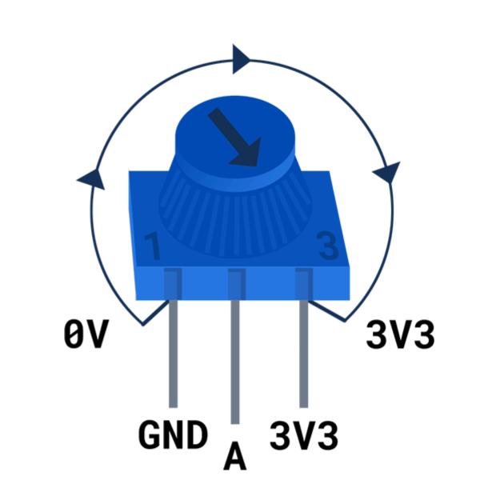
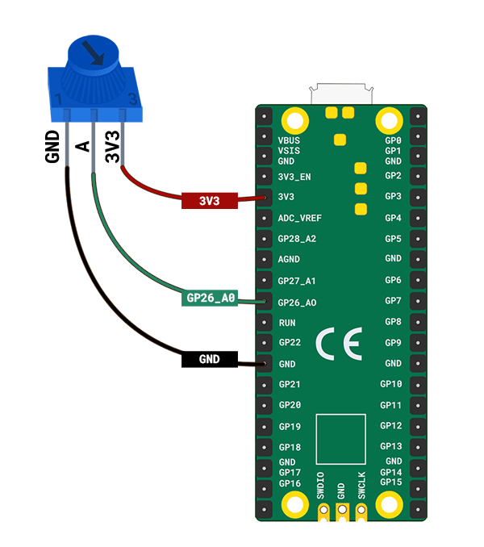

## Read values from a dial

A potentiometer (dial) allows you to provide a range of values. The Thonny plotter allows you to display those values so you can see the effect of turning the dial.

{:width="300px"}

The Raspberry Pi Pico has three analogue input pins that can be used to read values from analogue input components such as a potentiometer. These pins are labelled as A0, A1, and A2. The Raspberry Pi Pico can read voltages from 0 to 3.3V using these pins.

--- task ---

Look at your potentiometer. Notice the dial on the top that allows you to turn it clockwise and anti-clockwise.

You will also notice that your potentiometer has **three** pins.

Hold your potentiometer the same way around as in this diagram:

{:width="300px"}

When the potentiometer is turned all the way to the left, the arrow points to the GND pin; when it is turned all the way to the right, the arrow points to the 3V3 pin. The middle pin is the pin that the Raspberry Pi Pico reads a value from.

--- /task ---

Make sure your Raspberry Pi Pico is **unplugged** from your computer.

--- task ---

Use three socket–socket jumper wires and attach one to each leg of the potentiometer. You may wish to secure the legs with some electrical tape if they feel loose.

**Connect** the other end of each jumper wire to the Raspberry Pi Pico:
+ Connect the pin labelled with a small '1' to the **GND** pin between **GP21** and **GP22**
+ Connect the middle pin to the **GP26_A0** pin
+ Connect the pin labelled with a small '3' to the **3V3** pin

--- /task ---

--- collapse ---

---
title: How does a potentiometer work?
---

A **potentiometer** is an analogue input component that changes its resistance depending on the position of the dial. A potentiometer has three pins that need to be connected to 3V3, an analogue pin, and GND. The 3V3 pin provides power to the potentiometer and the voltage reading from the analogue pin will change depending on the resistance of the potentiometer.

--- /collapse ---

--- task ---

Plug your Raspberry Pi Pico into your computer.

In Thonny, create a new file and add the following code to `print` the value from the potentiometer.

--- code ---
---
language: python filename: line_numbers: true line_number_start: 1
line_highlights:
---
from picozero import Pot # Pot is short for Potentiometer from time import sleep

dial = Pot(0) # Connected to pin A0 (GP26)

while True: print(dial.value) sleep(0.1) # Slow down the output

--- /code ---

The `sleep(0.1)` line slows down the reading and printing of values from the potentiometer so that Thonny can keep up with the output.

--- /task ---

--- task ---

**Test:** Run your script and Thonny should start printing values to the shell. Turn the potentiometer to see the value change.

--- /task ---

It's quite hard to see what's happening when the values are printing so quickly. Thonny has a plotter that you can use to visualise the values from the potentiometer instead.

--- task ---

In Thonny, choose **View**->**Plotter** and the plotter will appear next to the shell.

--- /task ---

--- task ---

**Test:** Run your script and turn the potentiometer. Watch the value change in the plotter.

--- print-only ---

--- /print-only ---

--- no-print ---

{:width="300px"}

--- /no-print ---

The value should be 0 (or close to 0) when the potentiometer is turned all the way to the left and 1 (or close to 1) when it is turned all the way to the right.

--- /task ---

--- task ---

**التصحيح:**

The values are the wrong way around.
+ Swap the jumper wires connected to **GND** and **3V3**.

--- /task ---

