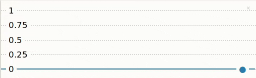
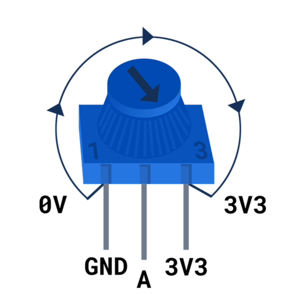
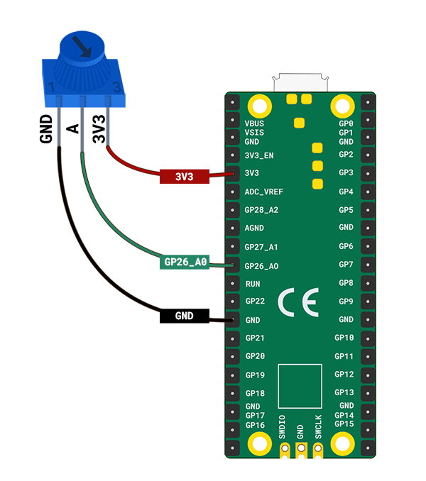
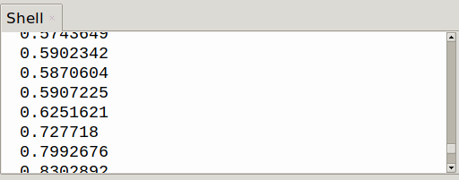
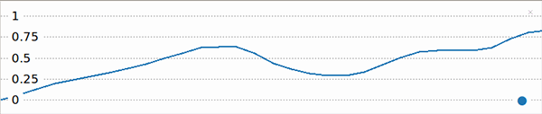

## Ανάγνωση τιμών από έναν επιλογέα

Ένα ποτενσιόμετρο (επιλογέας) σου επιτρέπει να παρέχεις ένα εύρος τιμών. Το plotter Thonny σου επιτρέπει να εμφανίζεις αυτές τις τιμές, ώστε να μπορείς να δεις το αποτέλεσμα της περιστροφής του επιλογέα.

{:width="300px"}

Το Raspberry Pi Pico έχει τρεις αναλογικούς ακροδέκτες εισόδου  που μπορούν να χρησιμοποιηθούν για την ανάγνωση τιμών από αναλογικά εξαρτήματα εισόδου, όπως ένα ποτενσιόμετρο. Αυτές οι ακίδες φέρουν την ένδειξη A0, A1 και A2. Το Raspberry Pi Pico μπορεί να διαβάσει τάσεις από 0 έως 3,3V χρησιμοποιώντας αυτές τις ακίδες.

--- task ---

Κοίτα το ποτενσιόμετρο σου. Παρατηρήστε τον επιλογέα στο πάνω μέρος που σου επιτρέπει να το περιστρέφετε δεξιόστροφα και αριστερόστροφα.

Θα παρατηρήσεις επίσης ότι το ποτενσιόμετρο σου έχει **τρεις** ακίδες.

Κράτησέ το ποτενσιόμετρο σου με τον ίδιο τρόπο όπως φαίνεται σε αυτό το διάγραμμα:

{:width="300px"}

Όταν το ποτενσιόμετρο περιστραφεί εντελώς αριστερά, το βέλος δείχνει τον ακροδέκτη GND. Όταν περιστραφεί εντελώς δεξιά, το βέλος δείχνει τον ακροδέκτη 3V3. Η μεσαία ακίδα είναι η ακίδα από την οποία το Raspberry Pi Pico διαβάζει μια τιμή.

--- /task ---

Βεβαιώσου ότι το Raspberry Pi Pico σου είναι **αποσυνδεδεμένο** από τον υπολογιστή σου.

--- task ---

Χρησιμοποίησε τρία καλώδια βραχυκύκλωσης υποδοχή-υποδοχή και σύνδεσε ένα σε κάθε πόδι του ποτενσιόμετρου. Μπορείς να ασφαλίσεις τα πόδια με λίγη μονωτική ταινία εάν είναι χαλαρά.

**Σύνδεσε** το άλλο άκρο κάθε καλωδίου βραχυκύκλωσης στο Raspberry Pi Pico:
+ Σύνδεσε την ακίδα που φέρει την ένδειξη '1' στην ακίδα **GND** μεταξύ **GP21** και **GP22**
+ Σύνδεσε τον μεσαίο ακροδέκτη στον ακροδέκτη **GP26_A0**
+ Σύνδεσε την ακίδα που φέρει την ένδειξη '3' στην ακίδα **3V3**

--- /task ---

--- collapse ---

---
Τίτλος: Πώς λειτουργεί ένα ποτενσιόμετρο;
---

Ένα ποτενσιόμετρο **** είναι ένα αναλογικό στοιχείο εισόδου που αλλάζει την αντίστασή του ανάλογα με τη θέση του επιλογέα. Ένα ποτενσιόμετρο έχει τρεις ακίδες που πρέπει να συνδεθούν στο 3V3, σε μια αναλογική ακίδα και στη γείωση. Ο ακροδέκτης 3V3 παρέχει τροφοδοσία στο ποτενσιόμετρο και η ένδειξη τάσης από τον αναλογικό ακροδέκτη θα αλλάζει ανάλογα με την αντίσταση του ποτενσιόμετρου.

--- /collapse ---

--- task ---

Σύνδεσε το Raspberry Pi Pico στον υπολογιστή σου.

Στο Thonny, δημιούργησε ένα νέο αρχείο και πρόσθεσε τον ακόλουθο κώδικα στο `για να εκτυπώσεις` την τιμή από το ποτενσιόμετρο.

--- code ---
---
language: python filename: line_numbers: true line_number_start: 1
line_highlights:
---
from picozero import Pot # Pot is short for Potentiometer from time import sleep

dial = Pot(0) # Connected to pin A0 (GP26)

while True: print(dial.value) sleep(0.1) # Slow down the output

--- /code ---

Η γραμμή `sleep(0.1)` επιβραδύνει την ανάγνωση και την εκτύπωση των τιμών από το ποτενσιόμετρο, έτσι ώστε ο Thonny να μπορεί να παρακολουθεί την έξοδο.

--- /task ---

--- task ---

**Δοκιμή:** Εκτέλεσε το σκριπτ σου και το Thonny θα πρέπει να ξεκινήσει την εκτύπωση τιμών στο κέλυφος. Γύρισε το ποτενσιόμετρο για να δεις την αλλαγή της τιμής.

--- /task ---

Είναι αρκετά δύσκολο να καταλάβει κανείς τι συμβαίνει όταν οι τιμές εκτυπώνονται τόσο γρήγορα. Το Thonny έχει ένα plotter που μπορείς να χρησιμοποιήσεις για να οπτικοποιήσεις τις τιμές από το ποτενσιόμετρο.

--- task ---

Στο Thonny, επίλεξε **Προβολή**->**Σχεδιαστής** και ο σχεδιαστής θα εμφανιστεί δίπλα στο κέλυφος.

--- /task ---

--- task ---

**Δοκιμή:** Εκτέλεσε το σενάριό σου και περίστρέψε το ποτενσιόμετρο. Παρακολούθησε την αλλαγή της τιμής στο σχεδιάγραμμα.

--- print-only ---

--- /print-only ---

--- no-print ---

{:width="300px"}

--- /no-print ---

Η τιμή θα πρέπει να είναι 0 (ή κοντά στο 0) όταν το ποτενσιόμετρο περιστρέφεται εντελώς αριστερά και 1 (ή κοντά στο 1) όταν περιστρέφεται εντελώς δεξιά.

--- /task ---

--- task ---

**Εντοπισμός σφαλμάτων:**

Οι αξίες είναι σε λάθος δρόμο.
+ Άλλαξε τα καλώδια βραχυκύκλωσης που είναι συνδεδεμένα στις υποδοχές **GND** και **3V3**.

--- /task ---

