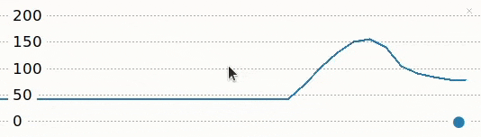
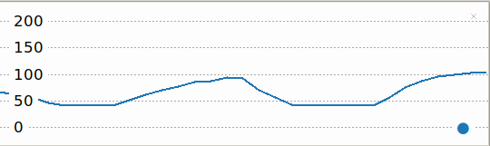

## Υπολογισμός παλμών ανά λεπτό (BPM)

Οι τιμές του ποτενσιόμετρου κυμαίνονται από 0 έως 1. Για να χρησιμοποιήσεις το ποτενσιόμετρο για τον έλεγχο του καρδιακού ρυθμού, πρέπει να μετατρέψεις αυτές τις τιμές σε έναν αντίστοιχο αριθμό από 40 (αθλητής σε πολύ καλή φυσική κατάσταση) έως 180 παλμούς ανά λεπτό. 

{:width="300px"}

Το BPM σημαίνει **παλμοί ανά λεπτό**. Μπορείτε να χρησιμοποιήσεις το BPM για να μετρήσεις τον καρδιακό σου ρυθμό (καθώς και το τέμπο της μουσικής). Όσο υψηλότερος είναι ο αριθμός, τόσο ταχύτερος είναι ο καρδιακός ρυθμός. Το BPM χρησιμοποιείται στην υγεία και τη φυσική κατάσταση για να μετρήσει πόσο έντονη είναι μια άσκηση. Μπορείς να υπολογίσεις τον μέγιστο καρδιακό σας ρυθμό αφαιρώντας την ηλικία σου από το 220. Για παράδειγμα, ο μέγιστος καρδιακός ρυθμός ενός 12χρονου είναι 208. Κατά την άσκηση, συνιστάται ο καρδιακός σας ρυθμός να μην υπερβαίνει το 85% του μέγιστου καρδιακού σας ρυθμού. Στην περίπτωση ενός 12χρονου, αυτό θα ήταν 176 BPM. Αυτό είναι περίπου το ίδιο τέμπο με ένα κομμάτι Drum 'n' Bass.

Τώρα θα χρησιμοποιήσεις το ποτενσιόμετρο για να ρυθμίσεις τον καρδιακό παλμό του έργου σου. Θα περιστρέψεις τον επιλογέα για να αυξήσεις ή να μειώσεις τον καρδιακό παλμό.

--- task ---

Ενημέρωσε τον κώδικά σου έτσι ώστε η τιμή που εκτυπώνεται και απεικονίζεται να αντιστοιχεί σε καρδιακό ρυθμό μεταξύ 40 και 180 παλμών ανά λεπτό.

--- code ---
---
language: python filename: line_numbers: true line_number_start: 1
line_highlights: 6-13
---
from picozero import Pot from time import sleep

dial = Pot(0)

heart_min = 40 heart_max = 180 heart_range = heart_max - heart_min # Calculate the difference

while True: bpm = heart_min + dial.value * heart_range # Convert dial value to BPM print(bpm) sleep(0.1)

--- /code ---

Παρατήρησε ότι η μεταβλητή `heart_range` υπολογίζεται **μία φορά** στην αρχή του σεναρίου σας, αλλά η μεταβλητή `bpm` εξαρτάται από την τιμή του ποτενσιόμετρου, επομένως υπολογίζεται μέσα στον βρόχο `while`.

--- /task ---

--- task ---

**Δοκιμή:** Εκτέλεσε τον κώδικά σου και περίστρεψε το ποτενσιόμετρο για να δεις πώς αλλάζουν ο αριθμός στο κέλυφος και οι ετικέτες στο σχεδιάγραμμα Thonny. Θα πρέπει τώρα να βλέπεις αριθμούς μεταξύ 40 και 180.

--- /task ---

--- task ---

**Εντοπισμός σφαλμάτων:**

Έχεις ένα συντακτικό σφάλμα:
+ Έλεγξε ότι ο κώδικάς σου ταιριάζει με τον κώδικα στα παραπάνω παραδείγματα

Το ποτενσιόμετρο σταμάτησε να λειτουργεί:
+ Έλεγξε ότι τα καλώδια βραχυκυκλωτήρα σου είναι ακόμα σταθερά συνδεδεμένα

--- /task ---

