## Φτιάξε μια καρδιά από χαρτί

Δημιούργησε την καρδιά από χαρτί για να συγκρατήσεις το παλλόμενο LED σου και να διαχέετε το φως. 

{:width="300px"}

Η χαρτοτεχνία είναι η τέχνη της δημιουργίας δισδιάστατων ή τρισδιάστατων δημιουργιών από χαρτί ή χαρτόνι. Το έργο τέχνης μπορεί να έχει τη μορφή γλυπτού, origami, φορετού μοντέλου ή μοντέλου από παπιέ-μασέ και να χρησιμοποιεί ένα ή περισσότερα κομμάτια κομμένου χαρτιού ή χαρτιού για ντοσιέ.

--- task ---

**Επίλεξε:** Φτιάξε μια κομμένη ή διπλωμένη καρδιά οριγκάμι για να βάλεις μέσα το παλλόμενο LED σου.

--- collapse ---
---
Τίτλος: Καρδιά κομμένη από χαρτί
---

Μπορείς να φτιάξεις μια απλή καρδιά, κομμένη από χαρτί:

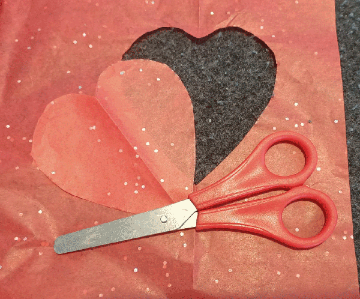

Ή κόψε δύο και ένωσε τα με ταινία: 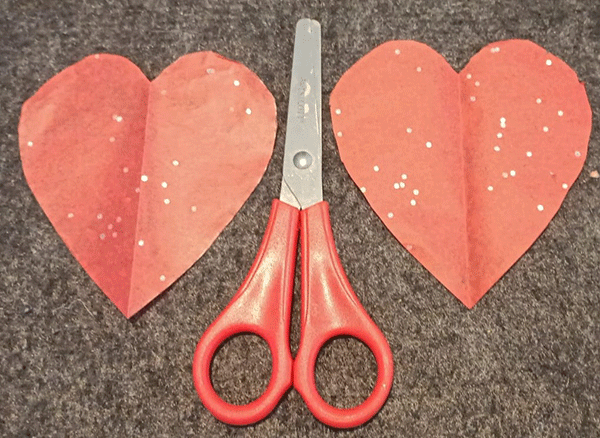

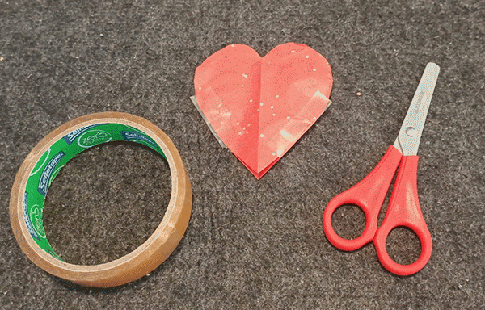

--- /collapse ---

--- collapse ---
---
τίτλος: Διπλωμένη καρδιά origami
---

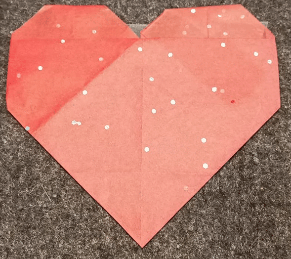

Βήμα 1: Ξεκίνησε με ένα τετράγωνο κομμάτι χαρτί. (Οποιοδήποτε χαρτί είναι κατάλληλο, αλλά το πιο λεπτό χαρτί θα κάνει το LED σου πιο φωτεινό.) 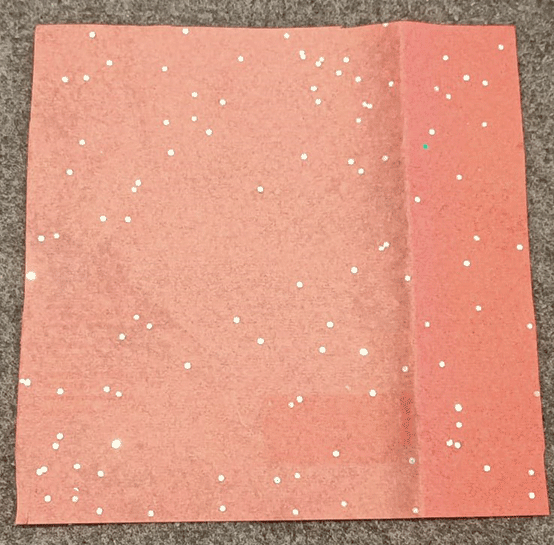

Βήμα 2: Δίπλωσε το χαρτί στη μέση διπλώνοντας την πάνω γωνία στην κάτω γωνία και στη συνέχεια ξεδίπλωσέ το. 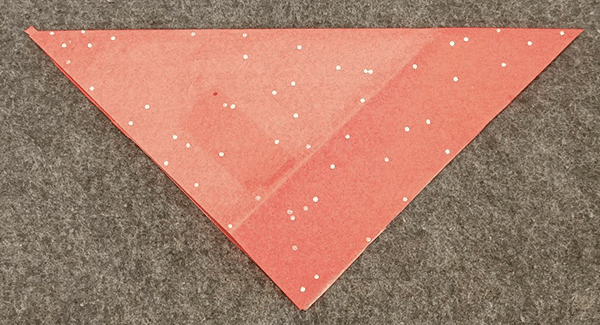

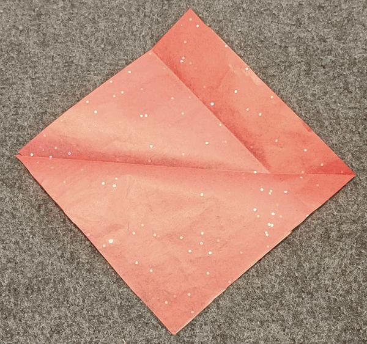

Βήμα 3: Δίπλωσε την αριστερή γωνία προς τη δεξιά γωνία και, στη συνέχεια, ξεδίπλωσε. 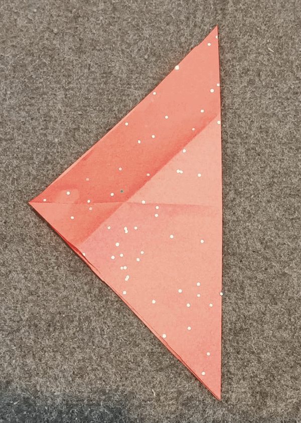

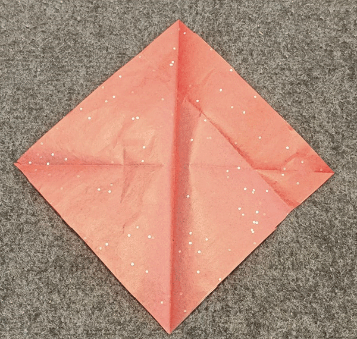

Βήμα 4: Δίπλωσε την πάνω γωνία προς το κέντρο του τετραγώνου, για να δημιουργήσεις ένα σχήμα «ασπίδας». 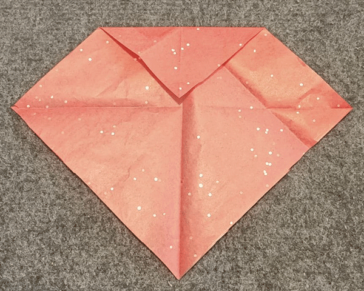

Βήμα 5: Δίπλωσε την κάτω γωνία προς τα πάνω για να συναντήσει την πάνω άκρη, επικαλύπτοντας την προηγούμενη πτυχή. 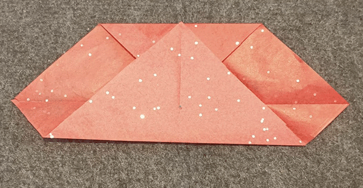

Βήμα 6: Δίπλωσε το κάτω αριστερό και το κάτω δεξί άκρο σε γωνία 90 μοιρών, έτσι ώστε οι κάτω άκρες τους να εκτείνονται κατά μήκος της κεντρικής πτυχής. 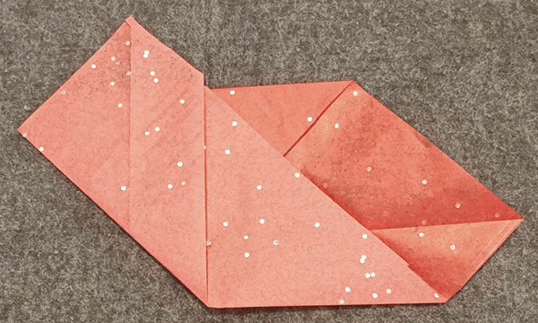

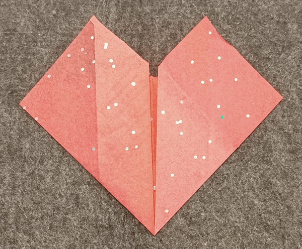

Βήμα 7: Δίπλωσε τις πάνω και τις πλευρικές γωνίες προς τα πίσω. 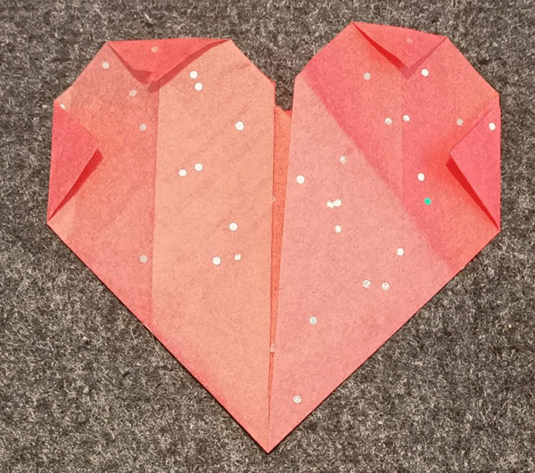

Βήμα 8: Κόλλησε την πίσω πλευρά της καρδιάς με ταινία στο πιο φαρδύ μέρος, από άκρη σε άκρη. 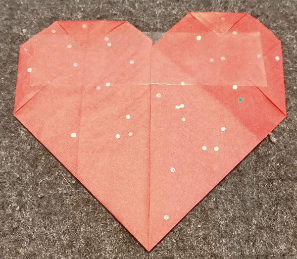

Γύρισε το για να δεις το μπροστινό μέρος και είσαι έτοιμος/η να ενσωματώσεις το LED σου! 

--- /collapse ---

--- /task ---

