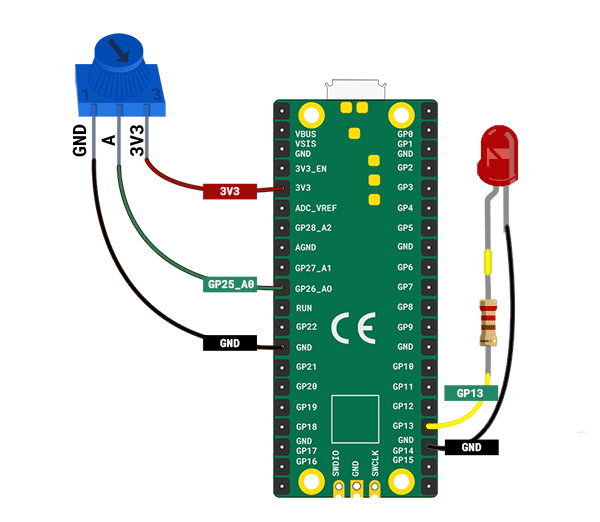
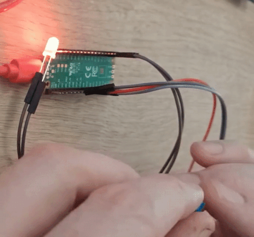
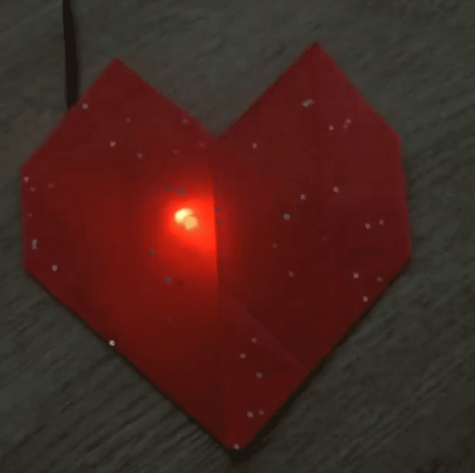

## Χτύπος καρδιάς LED

Δώσε ζωή στην καρδιά σου με έναν ενσωματωμένο παλμό LED.

{:width="300px"}

[[[flashing-light-warning]]]

--- task ---

Χρησιμοποίησε μια κόκκινη λυχνία LED **** συνδεδεμένη σε μια αντίσταση και καλώδια βραχυκύκλωσης.

Μπορείς να φτιάξεις το δικό σου αν χρειαστεί.

[[[led-resistor-electrical-tape]]]

[[[led-resistor-solder-heat-shrink]]]

--- /task ---

--- task ---

Σύνδεσε το κόκκινο LED στον ακροδέκτη **13** και στον ακροδέκτη **GND**, όπως ακριβώς έκανες όταν έφτιαξες μια πυγολαμπίδα LED.

--- /task ---

Η Maggie Aderin-Pocock είναι μια διαστημική επιστήμονας που έχει εργαστεί σε πολλές ηλεκτρονικές συσκευές, όπως αξεσουάρ τηλεσκοπίων, έναν φορητό ανιχνευτή ναρκών και όργανα που έχουν σταλεί στο διάστημα για τη συλλογή δεδομένων που βοηθούν στην κατανόηση της κλιματικής αλλαγής. Ως έφηβη, η Μάγκι δεν είχε την οικονομική δυνατότητα να αγοράσει ένα καλό τηλεσκόπιο, οπότε παρακολούθησε ένα μάθημα όπου μπορούσε να κατασκευάσει το δικό της τηλεσκόπιο χρησιμοποιώντας ηλεκτρονικά, κώδικα και λείανση γυαλιού για την κατασκευή φακών. Υπάρχει κάποιο gadget που θα ήθελες να φτιάξεις;

--- task ---

Πρόσθεσε κώδικα για να προγραμματίσεις το LED σου:

--- code ---
---
language: python filename: line_numbers: true line_number_start: 1
line_highlights: 1, 5
---
from picozero import Pot, LED # Add LED from time import sleep

dial = Pot(0) led = LED(13) # Make sure this is the correct pin

--- /code ---

--- /task ---

--- task ---

Πρόσθεσε κώδικα για να ελέγξεις τη φωτεινότητα `` του LED σου. Η μέθοδος `pulse()` επιτρέπει στο LED να παλμολογείται αυξάνοντας τη φωτεινότητά του και την ένταση του.

--- code ---
---
language: python filename: line_numbers: true line_number_start: 7
line_highlights: 10-14
---
while True: bpm = heart_min + dial.value * heart_range print(bpm) beat = 60/bpm brighter_time = beat / 2 # Spend half a beat getting brighter dimmer_time = beat / 2 # Spend half a beat getting dimmer

    led.pulse(brighter_time, dimmer_time, n=1, wait=True)  # Pulse 1 time, waiting until finished
--- /code ---

Αν δεν πρόσθεσες το `wait=True` στον παλμό `` , τότε ο βρόχος `while` θα επαναλαμβανόταν αμέσως και ο παλμός θα επανεκκινούσε.

--- /task ---

--- task ---

**Δοκιμή:** Εκτέλεσε το έργο σου για να δεις τον παλμό της λυχνίας LED να γίνεται πιο φωτεινός και πιο αμυδρός. Γύρισε το ποτενσιόμετρο για να ελέγξεις την ταχύτητα με την οποία παλμούν οι λυχνίες LED ώστε να αντιστοιχούν στον καρδιακό ρυθμό.

--- /task ---

--- task ---

**Εντοπισμός σφαλμάτων:**

Έχεις ένα συντακτικό σφάλμα:
+ Έλεγξε ότι ο κώδικάς σου ταιριάζει με τον κώδικα στα παραπάνω παραδείγματα

Το ποτενσιόμετρο σταμάτησε να λειτουργεί:
+ Έλεγξε ότι τα καλώδια βραχυκυκλωτήρα σου είναι ακόμα σταθερά συνδεδεμένα

Η λυχνία LED δεν ανάβει:
+ Έλεγξε ότι είναι σωστά συνδεδεμένο
+ Έλεγξε αν η λυχνία LED έχει καεί αντικαθιστώντας την με μια εφεδρική.

--- /task ---

--- task ---

Τώρα, πάρε την χάρτινη καρδιά σου και τοποθέτησέ την πάνω από το κόκκινο LED σου για να δημιουργήσεις το εφέ του καρδιακού παλμού.

--- /task ---

