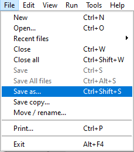
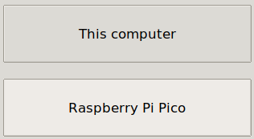
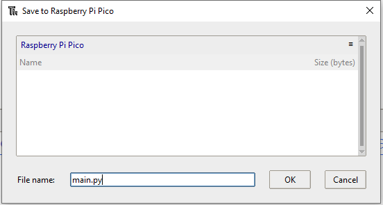
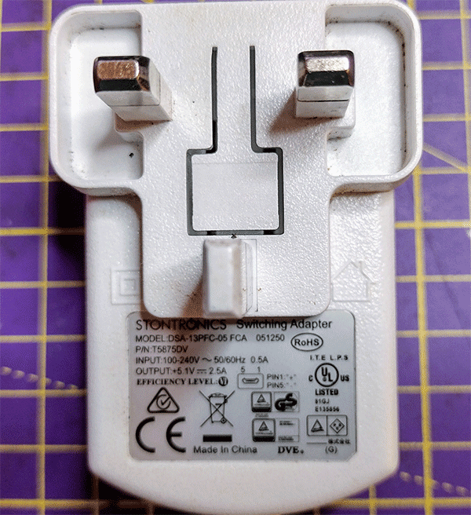
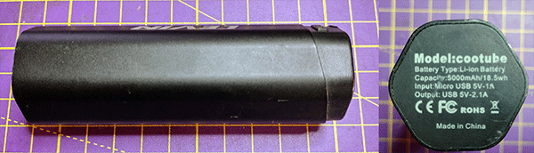
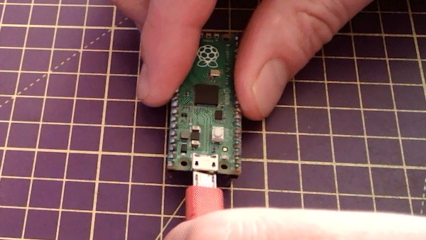

## Κάνε το φορητό

Δώσε ζωή στην καρδιά σου με έναν ενσωματωμένο παλμό LED. Μπορείς να τροφοδοτήσεις το Raspberry Pi Pico σου μακριά από τον υπολογιστή με τροφοδοτικό USB ή μπαταρία. Όταν ενεργοποιήσεις το Pico, θα εκτελεστεί ένα αρχείο με το όνομα `main.py`. 

{:width="300px"}

### Εκτέλεσε αυτόματα το πρόγραμμα "καρδιά που χτυπά" χρησιμοποιώντας το main.py

--- task ---

Χρησιμοποίησε το μενού **Αρχείο** για να αποθηκεύσεις τον κώδικά σου στη συσκευή Raspberry Pi Pico, χρησιμοποιώντας την επιλογή **Αποθήκευση ως...**.

--- /task ---

--- task ---

Επίλεξε να αποθηκεύσεις τον κώδικά σου στο Raspberry Pi Pico σου.

--- /task ---

--- task ---

Κάλεσε το αρχείο σου`main.py` για να εκτελείς αυτόματα όταν το Pico σου τροφοδοτείται από εξωτερική τροφοδοσία ρεύματος, η οποία δεν είναι συνδεδεμένη στον υπολογιστή σου.

--- /task ---

--- task ---

Αν αποθηκευτεί ως `main.py` στο Raspberry Pi Pico, τότε το πρόγραμμα θα φορτώσει όταν η συσκευή τροφοδοτείται από εξωτερική τροφοδοσία ρεύματος, όπως μια μπαταρία.

--- /task ---

### Τροφοδότησε την καρδιά σου που χτυπάει χρησιμοποιώντας μια τροφοδοσία USB

Το Raspberry Pi Pico απαιτεί τροφοδοτικό ικανό να παρέχει τουλάχιστον 1,8V και μέγιστο 5,5V.

Οι περισσότεροι μετασχηματιστές micro USB μπορούν να παρέχουν τροφοδοσία στο Raspberry Pi Pico σου σε αυτήν την περιοχή. Για παράδειγμα, ο επίσημος μετασχηματιστής micro USB του Raspberry Pi παρέχει έως και 2,5A ρεύματος στα 5,1V.

Μια μπαταρία με καλώδιο USB σε micro USB μπορεί επίσης να τροφοδοτήσει ένα Raspberry Pi Pico. Αυτή η μπαταρία παρέχει έως και 2,1A ρεύματος στα 5V.

--- task ---

Αποσύνδεσε το Raspberry Pi Pico από τον υπολογιστή σου.

--- /task ---

--- task ---

Σύνδεσε το Raspberry Pi Pico στον μετασχηματιστή ή την μπαταρία σου.

--- /task ---

--- task ---

**Δοκιμή:** Ενεργοποίησε το τροφοδοτικό USB ή την μπαταρία.

Θα πρέπει να μπορείς να περιστρέψεις το ποτενσιόμετρο για να ρυθμίσεις την ταχύτητα του καρδιακού παλμού.

<video width="640" height="360" controls>
<source src="images/beating-heart.mp4" type="video/mp4">
Το πρόγραμμα περιήγησής σου δεν υποστηρίζει βίντεο WebM, επομένως δοκίμασε το FireFox ή το Chrome
</video>

--- /task ---

--- task ---

**Εντοπισμός σφαλμάτων:**

--- collapse ---
---
Τίτλος: Η λυχνία LED δεν ανάβει
---

+ Λειτουργεί η μπαταρία σου; Είναι ενεργοποιημένη η μπαταρία; Θα μπορούσες να δοκιμάσεις μια άλλη συσκευή που τροφοδοτείται από USB για να βεβαιωθείς.

+ Αποθήκευσες το αρχείο ως `main.py`; Σύνδεσε ξανά το Pico στον υπολογιστή σου και αποθήκευσε ξανά το αρχείο. Έλεγξε προσεκτικά το όνομα του αρχείου και την επέκταση `.py`.

--- /collapse ---

--- /task ---

