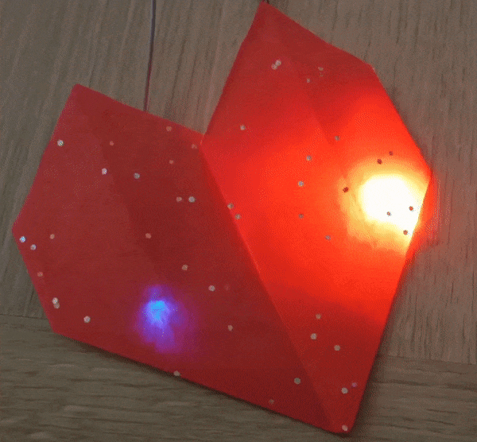

## Αναβάθμισε το έργο σου

Εάν έχεις χρόνο, μπορείς να αναβαθμίσεις το έργο σου 'Καρδιά που χτυπά' . 

Μπορείς να χρησιμοποιήσεις την φορητή σου καρδιά που χτυπάει ως διακόσμηση δωματίου. Ρύθμισε το σε χαμηλή ταχύτητα για να χαλαρώσεις. Ή, προσάρμοσε τον ρυθμό ώστε να ταιριάζει με τη μουσική που ακούτε. 

{:width="300px"}

--- task ---

Θα μπορούσες να:
+ Δημιούργησε μια καλύτερη καρδιά από χαρτί.
+ Πρόσθεσε ένα μπλε LED που να αντιπροσωπεύει το αποξυγονωμένο αίμα που εισέρχεται και εξέρχεται από την καρδιά.
+ Πρόσθεσε έναν ήχο καρδιακού παλμού χρησιμοποιώντας ένα παθητικό βομβητή.
+ Πρόσθεσε περισσότερα LED και καρδιές από χαρτί κάνοντάς τα να πάλλονται ταυτόχρονα. Επίλεξε οποιοδήποτε χρώμα LED θέλεις.
+ --- /task ---

--- collapse ---

---
title: Ολοκληρωμένο έργο
---

Μπορείς να δεις [ολοκληρωμένο το έργο εδώ](https://rpf.io/p/en/beating-heart-get){:target="_blank"}.

--- /collapse ---
