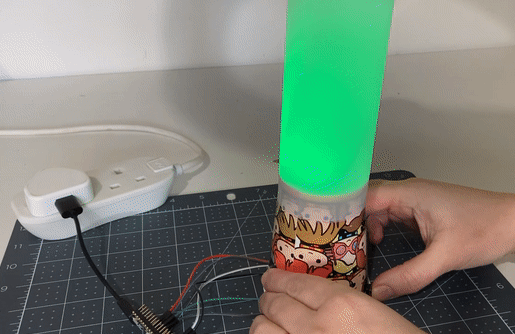
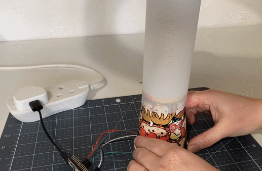

## Και τώρα;

Αν ακολουθείς τη διαδρομή [Εισαγωγή στο Raspberry Pi Pico](https://projects.raspberrypi.org/en/raspberrypi/pico-intro) , μπορείς να προχωρήσεις στο έργο [Ένδειξη διάθεσης](https://projects.raspberrypi.org/en/projects/mood-indicator) . Σε αυτό το έργο, θα δημιουργήσεις μια συσκευή ελέγχου διάθεσης με χρωματιστά φώτα για να εκφράσεις την τρέχουσα διάθεσή σου.

--- print-only ---

--- /print-only ---

--- no-print ---

--- /no-print ---
