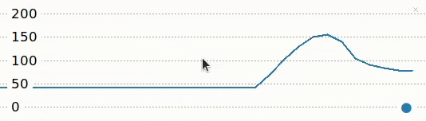

## Calculate beats per minute (BPM) 

The potentiometer values go from 0 to 1. To use the potentiometer to control the heart rate you need to turn these values into number corresponding to a from 40 (very fit athlete) to 180 beats per minute. 

{:width="300px"}

BPM stands for **beats per minute**. We can use BPM to measure our heart rate (as well as the tempo of music). The higher the number, the faster the heartrate. BPM is used in health and fitness to measure how intense an exercise is. You can work out your maximum heartrate by taking away your age from 220. For example, a 12 year old's maximum heart rate is 208. When exercising, it is advised that your heartrate doesn't exceed 85% of your maximum heart rate. In the case of a 12 year old, this would be 176 bpm! (About the same tempo as a Drum n' Bass track.)

The `bpm` variable in the code below is calculated by first working out the difference between the fastest and slowest heart rates - this is called the *range*. As you turn the potentiometer, the increasing value of the dial (between 0 and 1) is multiplied by the *range* and this number is added to the minimum to give us the overall `bpm`.

Calculation examples:

| Potentiometer value      | Calculation | BPM |
| ----------- | ----------- | ----------- |
| 0     | 40 + (0 x 140)       | 40 |
| 0.5   | 40 + (0.5 x 140)       | 110 |
| 1.0 | 40 + (1 x 140) | 180 |

--- task ---

Update your code so that the value that is printed and plotted corresponds to a heart rate between 40 and 180 beats per minute.

--- code ---
---
language: python
filename: 
line_numbers: true
line_number_start: 1
line_highlights: 7-11
---
from picozero import Pot
from time import sleep

dial = Pot(0)

min = 40
max = 180
heart_range = max - min

while True:
    bpm = min + dial.value * heart_range
    print(bpm)
    sleep(0.1)

--- /code ---

Notice that the `heart_range` variable is calculated once at the beginning of your script, but the `bpm` variable depends on the value of the potentiometer so it gets calculated inside the `while` loop.

--- /task ---

--- task ---

**Test:** Run your code and turn the potentiometer and see how the number in the Shell and the labels in the Thonny plotter change. You should now see numbers between 40 and 180.

 
--- /task ---

--- save ---
