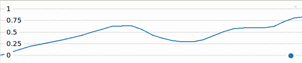

## Calculate beats per minute (BPM) 

The potentiometer values go from 0 to 1. To use the potentiometer to control the heart rate you need to turn these values into number corresponding to a from 40 (very fit athlete) to 180 beats per minute. 

{:width="300px"}

--- task ---
Update your code so that the value that is printed and plotted corresponds to a heart rate between 40 and 180 beats per minute.

The `bpm` variable is calculated by starting with the minimum heart range that you need to be able to select and then multiplying the value of the potentiometer (between 0 and 1) by the difference between the min and max heart rates (140). 

Calculation examples:
| Potentiometer value      | Calculation | BPM |
| ----------- | ----------- | ----------- |
| 0     | 40 + (0 x 140)       | 40 |
| 0.5   | 40 + (0.5 x 140)       | 110 |
| 1.0 | 40 + (1 x 140) | 180 |

--- code ---
---
language: python
filename: 
line_numbers: true
line_number_start: 1
line_highlights: 7-11
---
from time import sleep
from picozero import Pot

dial = Pot(0)

min = 40
max = 180
heart_range = max - min

while True:
    bpm = min + dial.value * heart_range
    print(bpm)
    sleep(0.1)

--- /code ---

Notice that the `heart_range` variable is calculated once at the beginning of your script, but the `bpm` variable depends on the value of the potentiometer so it gets calculated inside the `while` loop.

--- /task ---

--- task ---

**Test:** Run your code and turn the potentiometer and see how the number in the Shell and the labels in the Thonny plotter change. You should now see numbers between 40 and 180.

 
--- /task ---

--- save ---
