## Make a Papercraft heart

Create the papercraft heart to contain your pulsing LED and diffuse the light. 

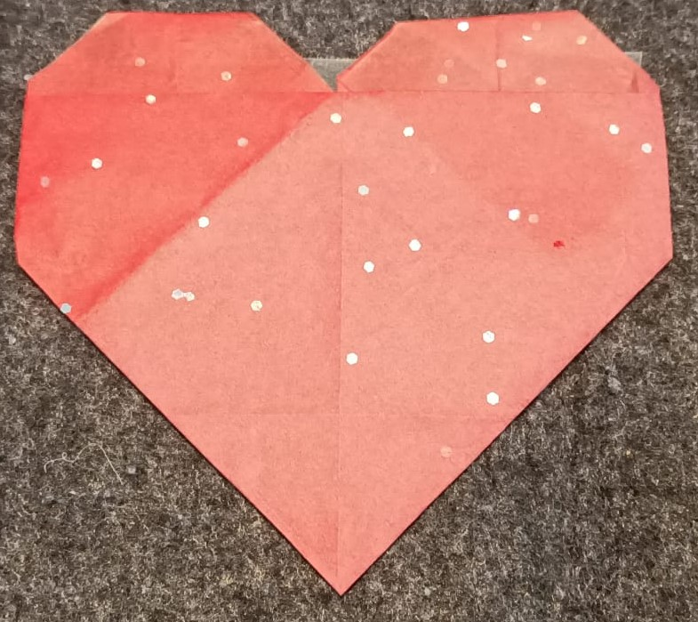{:width="300px"}

Papercraft is the art of making 2D or 3D creations out of paper or card. The artwork might take the form of a sculpture, origami, wearable, or papier-mâché model and use one or more piece of cut or folder paper.

--- task ---

**Choose** Make a cut-out or a folded origami heart to put your pulsing LED inside.

--- collapse ---
---
title: Paper cut-out heart
---

You can make a simple heart, cut out of paper:

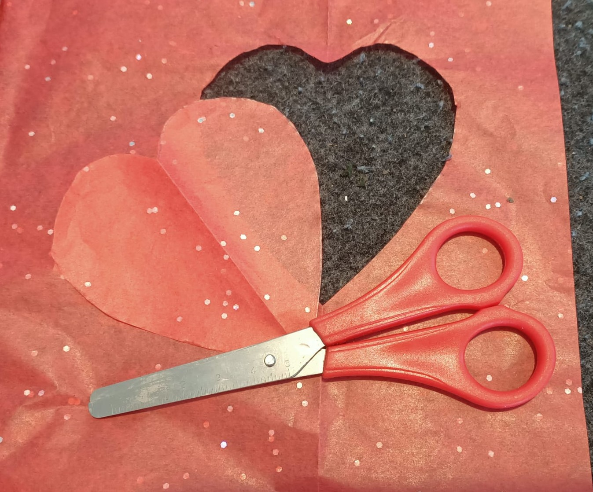

Or cut two, and tape them together:
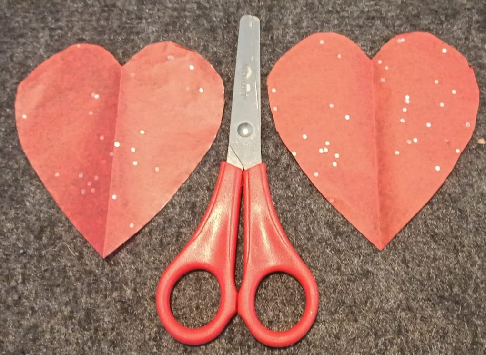

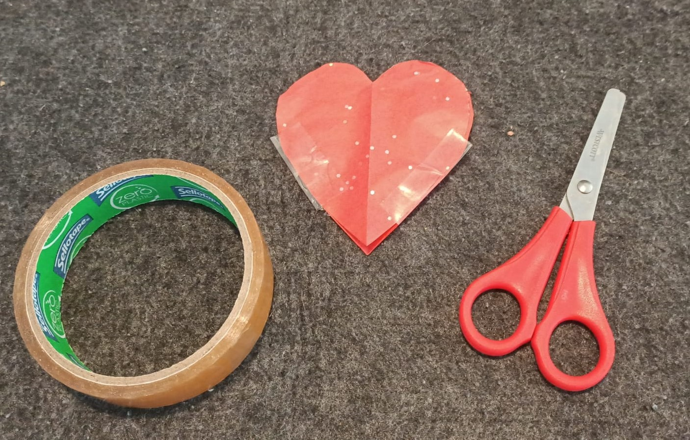

--- /collapse ---

--- collapse ---
---
title: Folded origami heart
---

Step 1: Start with a square piece of paper. (Any paper will do, but thinner paper will make your LED brighter.) 
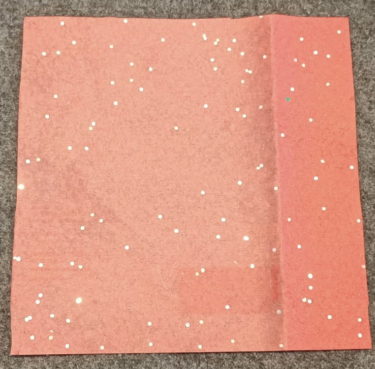

Step 2: Fold the paper in half by folding the top corner to the bottom corner, then unfold.
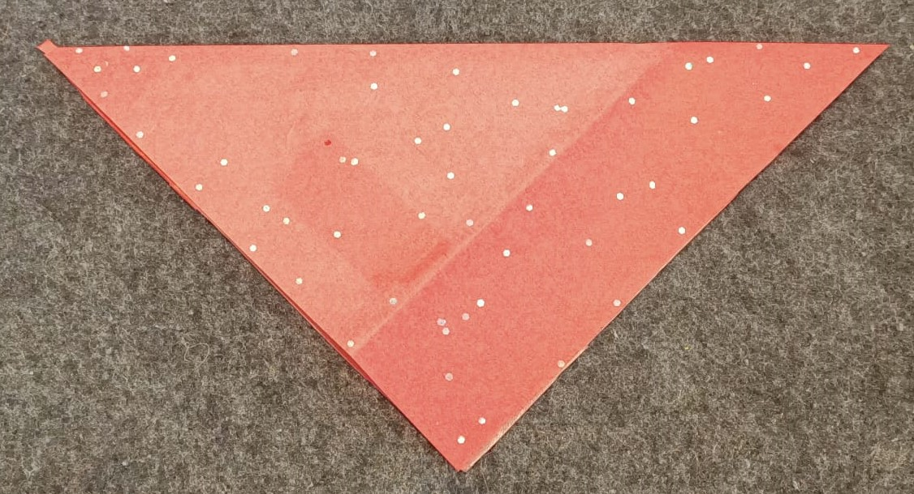

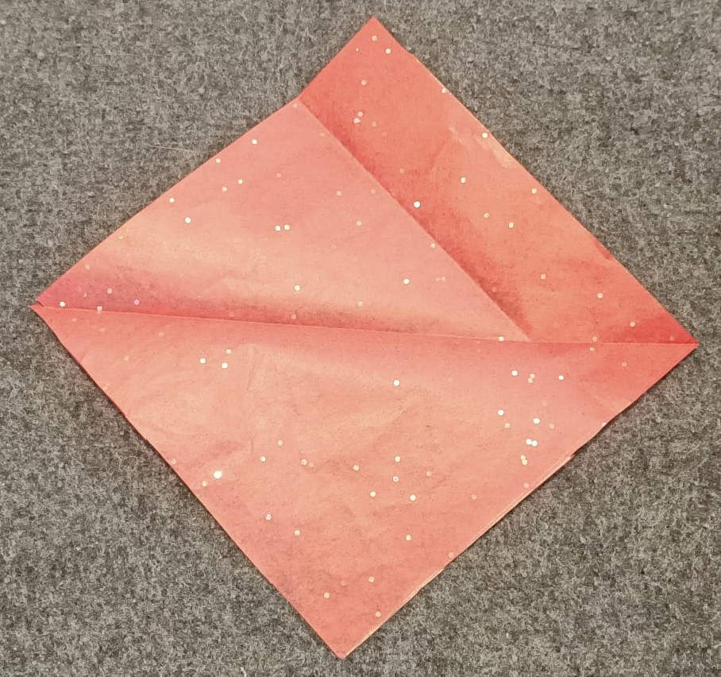

Step 3: Fold the left corner to the right corner, then unfold.
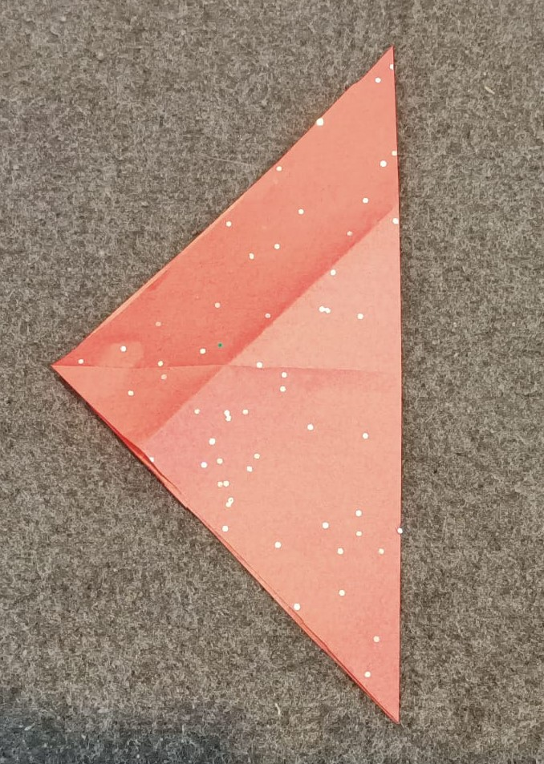

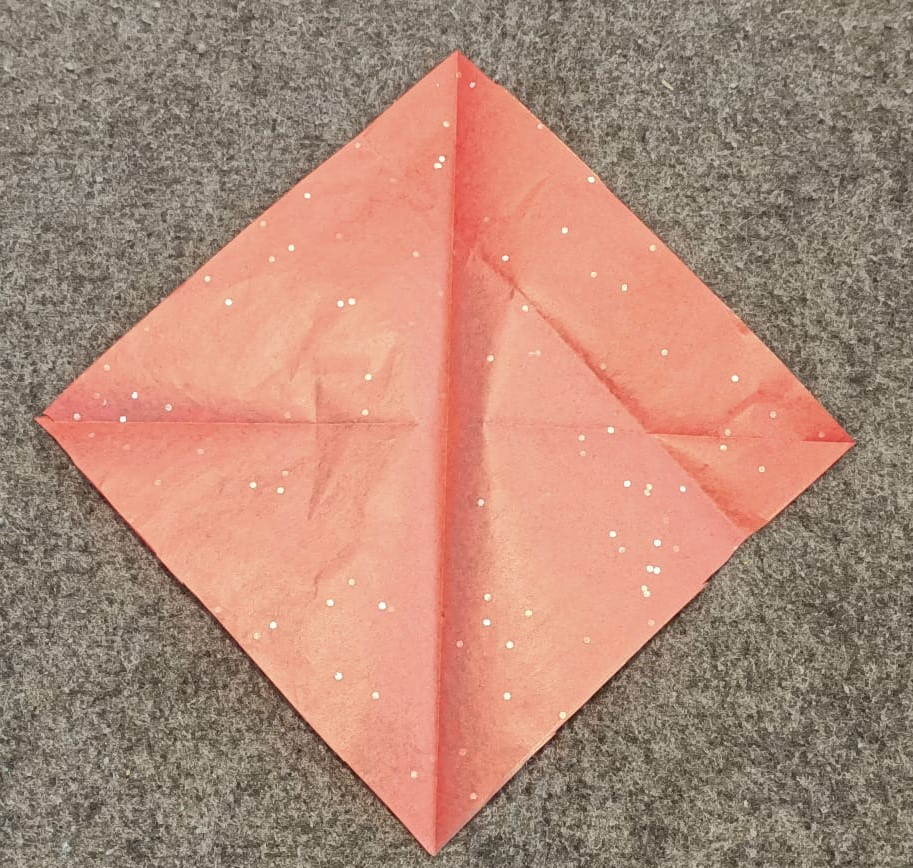

Step 4: Fold the top corner to the center of the square, to make a 'shield' shape.
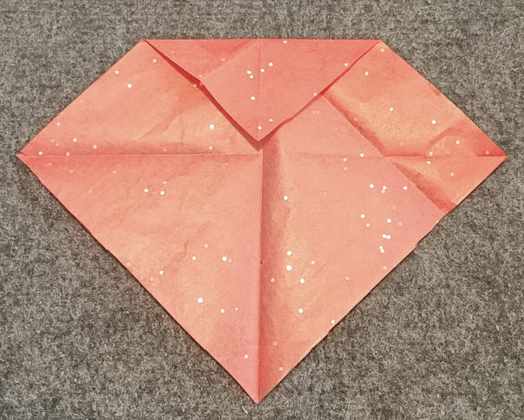

Step 5: Fold the bottom corner up to meet the top edge, overlapping the previous fold.
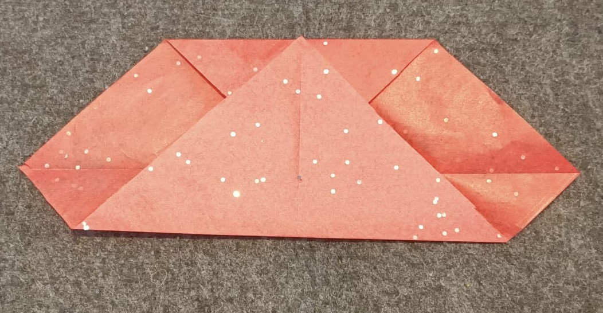

Step 6: Fold the bottom left and right ends up at a 90 degree angle, so that their lower edges run along the center crease.
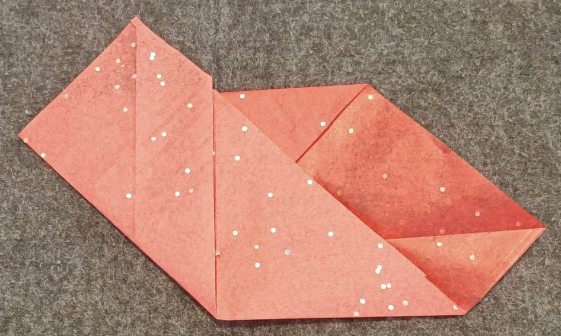

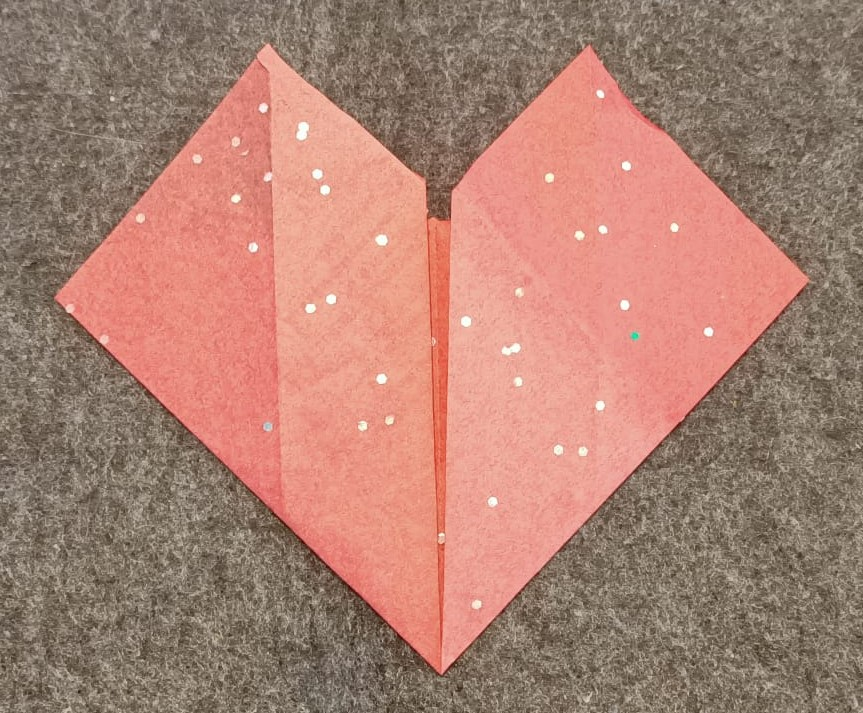

Step 7: Fold the top and side corners back.
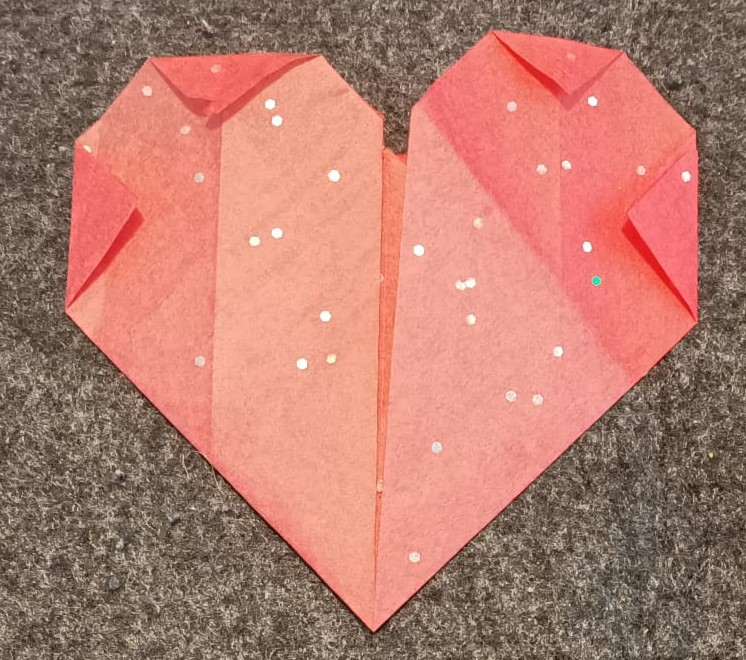

Step 8: Tape the back side of the heart across the widest part, from edge to edge.
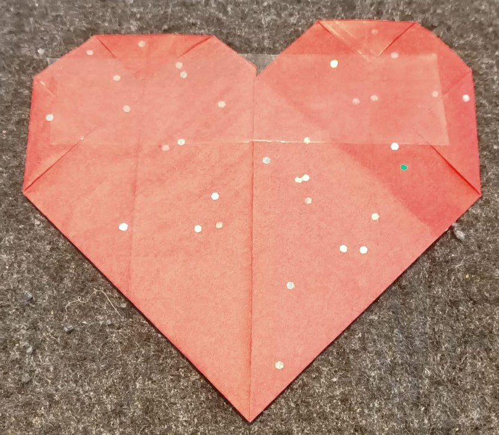

Turn it over to look at the front, and you're ready to embed your LED!

--- /collapse ---

--- /task ---

--- save ---

