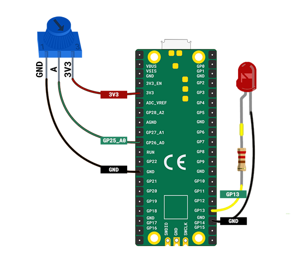

## LED heart beat

Bring your heart to life with an embedded LED heartbeat.

{:width="300px"}

[[[flashing-light-warning]]]

--- task ---

Use a **red** LED connected to a resistor and jumper wires. 

You can make your own if you need to.

[[[led-resistor-electrical-tape]]]

[[[led-resistor-solder-heat-shrink]]]

--- /task ---

--- task ---

Connect the red LED to **pin 13** and **GND**, just like you did when you made an LED firefly.

--- /task ---

Maggie Aderin-Pocock is a space scientist who has worked on lots of electronic gadgets including telescope accessories, a handheld landmine detector and instruments that have been sent to space to gather data to help understand climate change. As a teenager, Maggie couldn't afford a good telescope so she went to a class where she could make her own telescope using electronics, code and glass grinding to make lenses. Is there a gadget you would like to make?

--- task ---

Add code so that you can program your LED:

--- code ---
---
language: python
filename: 
line_numbers: true
line_number_start: 1
line_highlights: 1, 5
---
from picozero import Pot, LED # Add LED
from time import sleep

dial = Pot(0)
led = LED(13) # Make sure this is the correct pin

--- /code ---

--- /task ---

--- task ---

Add code to your `while` loop so that the LED blinks on and off based on the heart rate:

--- code ---
---
language: python
filename: 
line_numbers: true
line_number_start: 10
line_highlights: 14-18
---

while True:
    bpm = heart_min + dial.value * heart_range
    print(bpm)
    beat = 60 / bpm # length of a single beat
    led.on()
    sleep(beat / 2) # on for half a beat
    led.off()
    sleep(beat / 2) # off for half a beat

--- /code ---

--- /task ---

--- task ---

**Test:** Run your code to see the LED blink on and off. Turn the potentiometer to it's lowest value to represent a very slow heart rate and see how the LED blinks. Gradually increase the heart rate by turning the potentiometer to see the LED blink faster. 

--- /task ---

--- task ---

Add code to control the `brightness` of your LED. Changing the brightness by a small amount in a loop creates a fade or pulsing effect. 

--- code ---
---
language: python
filename: 
line_numbers: true
line_number_start: 7
line_highlights: 10-14
---
while True: 
    bpm = heart_min + dial.value * heart_range
    print(bpm)
    beat = 60 / bpm
    delay = beat / 200 # time needed for each change

    for brightness in range(0, 100): # getting brighter
        led.brightness = brightness / 100
        sleep(delay) # wait for 1/200ths of a beat

    for brightness in range(100, 1, -1): # getting dimmer
        led.brightness = brightness / 100
        sleep(delay) # wait for 1/200ths of a beat

--- /code ---

--- /task ---

--- task ---

**Test:** Run your project to see the LED pulse brighter and dimmer. Turn the potentiometer to control how fast the LED pulses to correspond to the heart rate. 

--- /task ---

--- task ---

Now, take your papercraft heart and place it over your red LED to make a heartbeat effect.

--- /task ---

--- save ---

