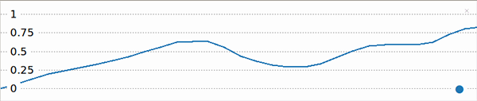

## Lire les valeurs d'un cadran

Un potentiomètre (cadran) permet de fournir une plage de valeurs. Le traceur Thonny vous permet d'afficher ces valeurs afin que tu puisses voir l'effet de tourner le cadran.

{:width="300px"}

Le Raspberry Pi Pico possède trois broches d'entrée analogiques  qui peuvent être utilisées pour lire des valeurs à partir de composants d'entrée analogiques tels qu'un potentiomètre. Ces broches sont étiquetées A0, A1 et A2. Le Raspberry Pi Pico peut lire des tensions de 0 à 3,3 V à l'aide de ces broches.

--- task ---

Regarde ton potentiomètre. Remarque le cadran sur le dessus qui te permet de le tourner dans le sens des aiguilles d'une montre et dans le sens inverse.

Tu remarqueras également que ton potentiomètre a **trois** broches.

Tiens ton potentiomètre de la même manière que sur ce schéma :

{:width="300px"}

Lorsque le potentiomètre est tourné à fond vers la gauche, la flèche pointe vers la broche GND ; lorsqu'il est tourné à fond vers la droite, la flèche pointe vers la broche 3V3. La broche du milieu est la broche à partir de laquelle le Raspberry Pi Pico lit une valeur.

--- /task ---

Assure-toi que ton Raspberry Pi Pico est **débranché** de ton ordinateur.

--- task ---

Utilises trois fils de connexion socket-socket et attaches-en un à chaque connecteur du potentiomètre. Tu voudras peut-être fixer les connecteurs avec du ruban électrique s'ils te semblent lâches.

**Branche** l'autre extrémité de chaque fil de liaison au Raspberry Pi Pico :
+ Connecte la broche marquée d'un petit '1' à la broche **GND** entre **GP21** et **GP22**
+ Connecte la broche du milieu à la broche **GP26_A0**
+ Connecte la broche étiquetée avec un petit '3' à la broche **3V3**

--- /task ---

--- collapse ---

---
title : Comment fonctionne un potentiomètre ?
---

Un **potentiomètre** est un composant d'entrée analogique qui change sa résistance en fonction de la position du cadran. Un potentiomètre a trois broches qui doivent être connectées à 3V3, une broche analogique et GND. La broche 3V3 alimente le potentiomètre et la lecture de tension de la broche analogique changera en fonction de la résistance du potentiomètre.

--- /collapse ---

--- task ---

Branche ton Raspberry Pi Pico sur ton ordinateur.

Dans Thonny, crée un nouveau fichier et ajoute le code suivant pour `imprimer` la valeur du potentiomètre.

--- code ---
---
language: python 
filename: 
line_numbers: true 
line_number_start: 1
line_highlights:
---
from picozero import Pot # Pot est l'abréviation de potentiomètre 
from time import sleep

dial = Pot(0) # Connecté à la broche A0 (GP26)

while True: 
    print(dial.value) 
    sleep(0.1) # Ralentir la sortie

--- /code ---

La ligne `sleep(0.1)` ralentit la lecture et l'impression des valeurs du potentiomètre afin que Thonny puisse suivre la sortie.

--- /task ---

--- task ---

**Test :** Exécute ton script et Thonny devrait commencer à imprimer des valeurs dans le shell. Tourne le potentiomètre pour voir la valeur changer.

--- /task ---

Il est assez difficile de voir ce qui se passe lorsque les valeurs s'impriment si rapidement. Thonny a un traceur que tu peux utiliser à la place pour visualiser les valeurs du potentiomètre.

--- task ---

Dans Thonny, choisis **Affichage**->**Grapheur** et le traceur apparaîtra à côté de la Console.

--- /task ---

--- task ---

**Test :** Exécute ton script et tourne le potentiomètre. Observe le changement de valeur dans le traceur.

--- print-only ---

--- /print-only ---

--- no-print ---

{:width="300px"}

--- /no-print ---

La valeur doit être 0 (ou près de 0) lorsque le potentiomètre est tourné à fond vers la gauche et 1 (ou près de 1) lorsqu'il est tourné à fond vers la droite.

--- /task ---

--- task ---

**Déboguer:**

Les valeurs sont dans le mauvais sens.
+ Intervertis les fils de liaison connectés à **GND** et **3V3**.

--- /task ---

