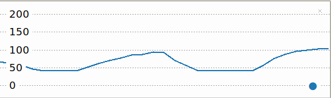

## Calculer les battements par minute (BPM)

Les valeurs du potentiomètre vont de 0 à 1. Pour utiliser le potentiomètre pour contrôler la fréquence cardiaque, tu devras transformer ces valeurs en un nombre correspondant de 40 (athlète très en forme) à 180 battements par minute. 

{:width="300px"}

BPM signifie **battements par minute**. Tu peux utiliser le BPM pour mesurer ta fréquence cardiaque (ainsi que le tempo de la musique). Plus le nombre est élevé, plus la fréquence cardiaque est rapide. Le BPM est utilisé dans le domaine de la santé et de la forme physique pour mesurer l'intensité d'un exercice. Vous pouvez déterminer votre fréquence cardiaque maximale en soustrayant votre âge à 220. Par exemple, la fréquence cardiaque maximale d'un enfant de 12 ans est de 208. Lors d'exercice, il est conseillé que ta fréquence cardiaque ne dépasse pas 85% de ta fréquence cardiaque maximale. Dans le cas d'un enfant de 12 ans, ce serait 176 BPM. C'est à peu près le même tempo qu'une piste Drum 'n' Bass.

Tu vas maintenant utiliser le potentiomètre pour régler le rythme cardiaque de ton projet. Tu tourneras la molette pour augmenter ou diminuer le rythme cardiaque.

--- task ---

Met à jour ton code afin que la valeur imprimée et tracée corresponde à une fréquence cardiaque comprise entre 40 et 180 battements par minute.

--- code ---
---
language: python 
filename: 
line_numbers: true 
line_number_start: 1
line_highlights: 6-13
---
from picozero import Pot 
from time import sleep

cadran = Pot(0)

coeur_min = 40 
coeur_max = 180 
coeur_gamme = coeur_max - coeur_min # Calculer la différence

while True: 
    bpm = coeur_min + cadran.value * coeur_gamme # Convertir la valeur du cadran en BPM 
    print(bpm) 
    sleep(0.1)

--- /code ---

Note que la variable `coeur_gamme` est calculée **une fois** au début de ton script, mais la variable `bpm` dépend de la valeur du potentiomètre, elle est donc calculée à l'intérieur de la boucle `while`.

--- /task ---

--- task ---

**Test :** Exécute ton code et tourne le potentiomètre pour voir comment le nombre change dans la console et les étiquettes dans le traceur Thonny. Tu devrais maintenant voir des nombres entre 40 et 180.

--- /task ---

--- task ---

**Déboguer:**

Tu as une erreur de syntaxe :
+ Vérifie que ton code correspond à l'exemple ci-dessus

Le potentiomètre a cessé de fonctionner :
+ Vérifie que tes fils de liaison sont toujours solidement attachés

--- /task ---

