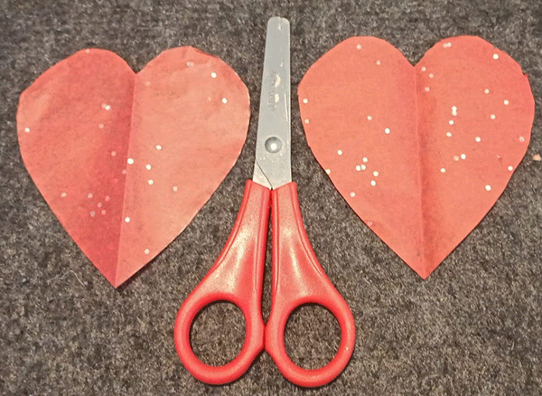
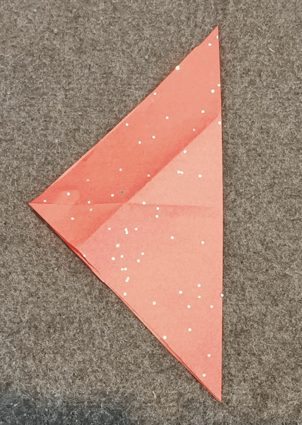
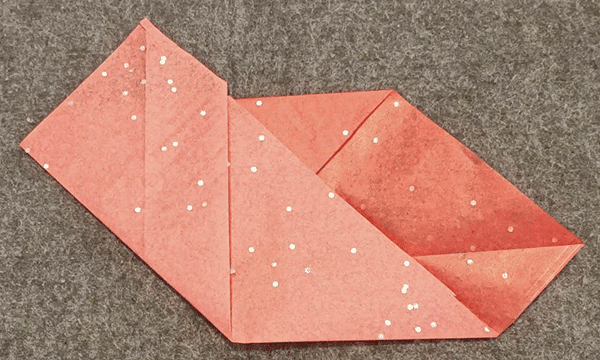

## Fabriquer un coeur en papier

Crée le cœur en papier pour contenir ta LED pulsée et diffuser la lumière. 

{:width="300px"}

Papercraft est l'art de réaliser des créations 2D ou 3D en papier ou en carton. L'œuvre d'art peut prendre la forme d'une sculpture, d'un origami, d'un modèle portable ou de papier mâché et utiliser un ou plusieurs morceaux de papier découpé ou de dossier.

--- task ---

**Choisis :** Fais une découpe ou un cœur en origami plié pour mettre ta LED pulsée à l'intérieur.

--- collapse ---
---
title: Coeur en papier découpé
---

Tu peux faire un cœur simple, découpé dans du papier:

Ou coupes-en deux et colle-les ensemble : 

--- /collapse ---

--- collapse ---
---
title: Coeur plié en origami
---

Étape 1 : Commence avec une feuille de papier carrée. (N'importe quel papier fera l'affaire, mais un papier plus fin rendra ta LED plus lumineuse.) 

Étape 2 : Plie le papier en deux en repliant le coin supérieur vers le coin inférieur, puis déplie-le. 

Étape 3 : Plie le coin gauche vers le coin droit, puis déplie. 

Étape 4 : Plie le coin supérieur vers le centre du carré pour créer une forme de « bouclier ». 

Étape 5 : Plie le coin inférieur vers le haut pour rejoindre le bord supérieur, en chevauchant le pli précédent. 

Étape 6 : Plie les extrémités inférieures gauche et droite à un angle de 90 degrés, de sorte que leurs bords inférieurs longent le pli central. 

Étape 7 : Replie les coins supérieurs et latéraux vers l'arrière. 

Étape 8 : Colle le côté arrière du cœur sur la partie la plus large, d'un bord à l'autre. 

Retourne-le pour voir l'avant et tu es prêt à intégrer ta LED ! 

--- /collapse ---

--- /task ---

