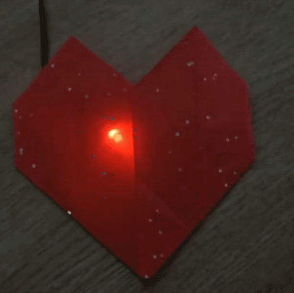

## LED Battement de cœur

Donne vie à ton cœur avec une LED battement de cœur intégrée.

{:width="300px"}

[[[flashing-light-warning]]]

--- task ---

Utilise une LED **rouge** connectée à une résistance et des fils de liaison.

Tu peux créer le tien si tu en as besoin.

[[[led-resistor-electrical-tape]]]

[[[led-resistor-solder-heat-shrink]]]

--- /task ---

--- task ---

Branche la LED rouge à la **broche 13** et **GND**, comme tu l'as fait lorsque tu as fabriqué une luciole LED.

--- /task ---

Maggie Aderin-Pocock est une scientifique spatiale qui a travaillé sur de nombreux gadgets électroniques, notamment des accessoires de télescope, un détecteur de mines antipersonnel portable et des instruments qui ont été envoyés dans l'espace pour recueillir des données permettant de comprendre les changements climatiques. Adolescente, Maggie n'avait pas les moyens d'acheter un bon télescope, alors elle est allée dans un cours où elle pouvait fabriquer son propre télescope en utilisant l'électronique, le code et le meulage du verre pour fabriquer des lentilles. Y a-t-il un gadget que tu aimerais fabriquer ?

--- task ---

Ajoute du code pour pouvoir programmer ta LED :

--- code ---
---
language: python filename: line_numbers: true line_number_start: 1
line_highlights: 1, 5
---
from picozero import Pot, LED # Add LED from time import sleep

dial = Pot(0) led = LED(13) # Make sure this is the correct pin

--- /code ---

--- /task ---

--- task ---

Ajoute du code pour contrôler la `luminosité` de ta LED. La méthode `pulse()` permet à la LED de clignoter en devenant plus lumineuse et plus sombre.

--- code ---
---
language: python filename: line_numbers: true line_number_start: 7
line_highlights: 10-14
---
while True: bpm = heart_min + dial.value * heart_range print(bpm) beat = 60/bpm brighter_time = beat / 2 # Spend half a beat getting brighter dimmer_time = beat / 2 # Spend half a beat getting dimmer

    led.pulse(brighter_time, dimmer_time, n=1, wait=True)  # Pulse 1 time, waiting until finished
--- /code ---

Si tu n'as pas ajouté `wait=True` à `pulse` , la boucle `while` se répéterait immédiatement et redémarrerait l'impulsion.

--- /task ---

--- task ---

**Test :** Exécute ton projet pour voir l'impulsion LED plus lumineuse et plus faible. Tourne le potentiomètre pour contrôler la vitesse à laquelle les impulsions LED correspondent à la fréquence cardiaque.

--- /task ---

--- task ---

**Déboguer:**

Tu as une erreur de syntaxe :
+ Vérifie que ton code correspond à l'exemple ci-dessus

Le potentiomètre a cessé de fonctionner :
+ Vérifie que tes fils de liaison sont toujours solidement attachés

La LED ne s'allume pas :
+ Vérifie qu'elle est correctement connectée
+ Vérifie si la LED a grillé en la remplaçant par une pièce de rechange

--- /task ---

--- task ---

Maintenant, prend ton cœur en papier et place-le sur ta LED rouge pour créer un effet de battement de cœur.

--- /task ---

