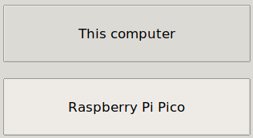
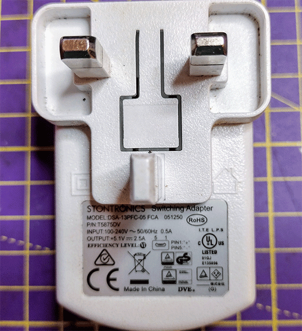
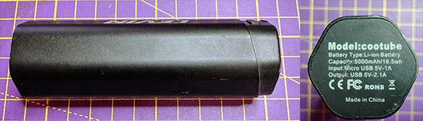
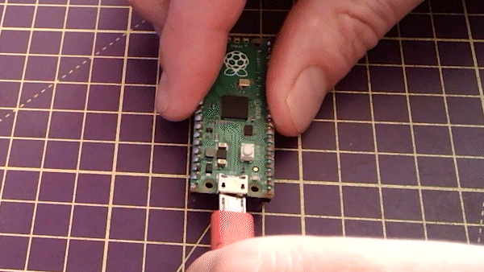

## Rends-le portable

Donne vie à ton cœur avec une LED battement de cœur intégré. Tu peux alimenter ton Raspberry Pi Pico loin de l'ordinateur avec une alimentation USB ou une batterie. Lorsque tu allumes le Pico, il exécute un fichier appelé "main.py". 

{:width="300px"}

### Exécute automatiquement ton programme de cœur battant à l'aide de main.py

--- task ---

Utilise le menu **Fichier** pour enregistrer ton code sur ton appareil Raspberry Pi Pico, en utilisant l'option **Enregistrer sous...**.

--- /task ---

--- task ---

Choisis d'enregistrer ton code sur ton Raspberry Pi Pico.

--- /task ---

--- task ---

Appel ton fichier `main.py` pour qu'il s'exécute automatiquement lorsque ton Pico est alimenté par une alimentation externe, non connectée à ton ordinateur.

--- /task ---

--- task ---

S'il est enregistré sous `main.py` sur le Raspberry Pi Pico, le programme se chargera lorsque l'appareil est alimenté par une alimentation externe, telle qu'une batterie.

--- /task ---

### Alimente ton cœur battant à l'aide d'une alimentation USB

Le Raspberry Pi Pico nécessite une alimentation capable de délivrer un minimum de 1,8V et un maximum de 5,5V.

La plupart des transformateurs micro USB peuvent alimenter ton Raspberry Pi Pico dans cette gamme. Par exemple, le transformateur micro USB officiel Raspberry Pi fournit jusqu'à 2,5 A de courant à 5,1 V.

Une batterie avec un câble USB vers micro USB peut également alimenter un Raspberry Pi Pico. Cette batterie fournit jusqu'à 2,1 A de courant à 5 V.

--- task ---

Déconnecte ton Raspberry Pi Pico de ton ordinateur.

--- /task ---

--- task ---

Connecte le Raspberry Pi Pico à ton transformateur ou à ta batterie.

--- /task ---

--- task ---

**Test :** Allume ton alimentation USB ou ta batterie.

Tu devrais pouvoir tourner le potentiomètre pour régler la vitesse du rythme cardiaque.

<video width="640" height="360" controls>
<source src="images/beating-heart.mp4" type="video/mp4">
Ton navigateur ne prend pas en charge la vidéo WebM, essaye FireFox ou Chrome
</video>

--- /task ---

--- task ---

**Déboguer:**

--- collapse ---
---
title: La LED ne s'allume pas
---

+ Ta batterie fonctionne-t-elle ? La batterie est-elle allumée ? Tu peux tester un autre appareil alimenté par USB pour t'en assurer.

+ As-tu enregistré le fichier sous `main.py`? Rebranche ton Pico sur ton ordinateur et enregistre à nouveau le fichier. Vérifie attentivement le nom du fichier et l'extension `.py`.

--- /collapse ---

--- /task ---

