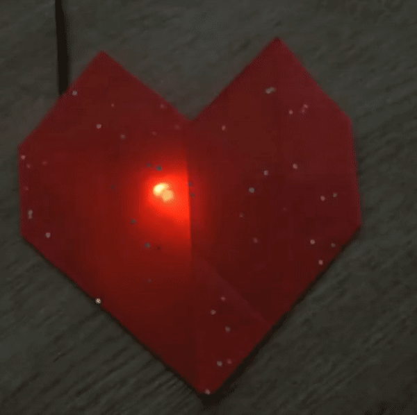

## You will make

दिल की दर को समायोजित करने के लिए एक हल्का-फुल्का, एक फुहारा हुआ दिल और एक डायल के साथ एक पेपर बनाएँ।

--- no-print ---

{:width="400px"}

--- /no-print ---

--- print-only ---

--- /print-only ---

[[[flashing-light-warning]]]

आप:
+ हृदय गति बदलने के लिए एक potentometer (डायल) का उपयोग करें
+ LED के साथ एक लुभावना प्रभाव बनाएँ
+ अपने Raspberry Pi Pico को अपने कंप्यूटर से दूर रखें

एक एनालॉग इनपुट केवल 0 या 1 (चालू या बंद) के बजाय, मानों की एक श्रेणी देता है। एक potentometer एक एनालॉग इनपुट घटक है जिसमें एक डायल है जिसे आप मानों को बढ़ाने या घटाने के लिए बदलते हैं। Raspberry Pi Pico में एनालॉग इनपुट पिन हैं जो आपको एनालॉग मान पढ़ने और उन्हें अपने कोड में उपयोग करने की अनुमति देते हैं। 

इस प्रोजेक्ट को पूरा करने के लिए आपको इसकी आवश्यकता होगी:

**हार्डवेयर**

You can purchase all the required hardware for this project and the other projects in this path from the [Pimoroni web store.](https://shop.pimoroni.com/products/pico-intro-kit?variant=39893512945747){:target='_blank'} and the [Kitronik web store.](https://kitronik.co.uk/products/5343-raspberry-pi-foundation-pico-pathway-pack){:target='_blank'}

+ पिन हेडर solden के साथ एक Raspberry Pi Pico
+ माइक्रो USB केबल के लिए एक डेटा USB A
+ One red LED with a resistor attached to jumper wires with socket connectors
+ one potentiometer (dial)
+ 3 x socket-socket jumper wires
+ यदि आपके पास पेपर है, तो लाल रंग की एक शीट
+ स्टिकी टेप या डक्ट टेप
+ Optionally, a blue LED, resistor and more jumper wires

[[[pin-socket-jumper-wires]]]

**सॉफ्टवेयर**

+ Thoneny – इस प्रोजेक्ट को Thonny Python एडिटर का उपयोग करके पूरा किया जा सकता है, जिसे लिनक्स, Windows, या मैक कंप्यूटर पर स्थापित किया जा सकता है

[[[thonny-install]]]

[[[change-theme-thonny]]]

--- no-print ---

--- task ---

एक potentiometer द्वारा नियंत्रित की जा रही दिल की धड़कन के वीडियो को देखें। क्या होता है जैसे डायल बाएं और दाएं ओर मुड़ता है?

<video width="640" height="360" controls>
<source src="images/beating-heart.mp4" type="video/mp4">
आपका ब्राउज़र WebM वीडियो का समर्थन नहीं करता है, FireFox या Chrome आज़माएँ
</video>

--- /task ---

--- /no-print ---
