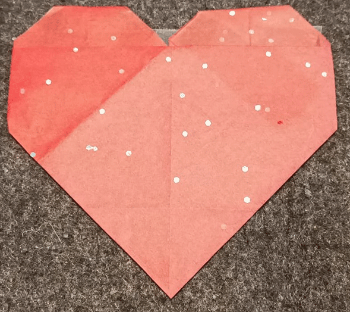
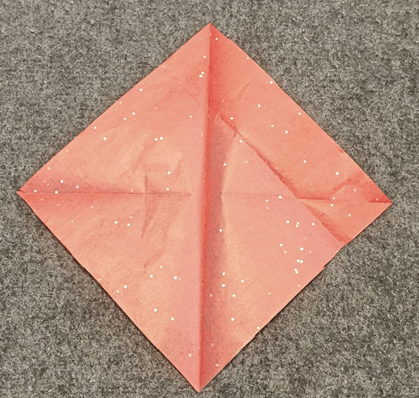
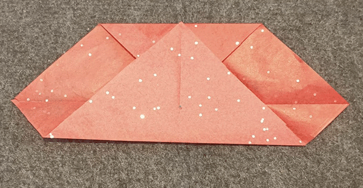
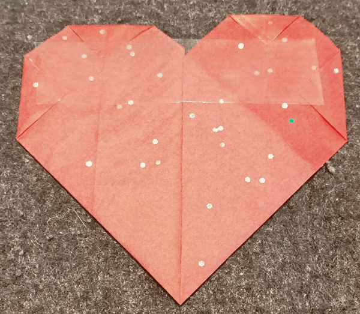

## एक हल्का-फुल्का दिल बनाएं

अपने pulsing LED को शामिल करने और प्रकाश को अलग करने के लिए Papeccraft heart बनाएँ। 

{:width="300px"}

Papercraft, 2D या 3D creations को कागज या कार्ड से बाहर बनाने की कला है। Artwork एक मूर्तिकला, उत्पत्ति, पहनने योग्य, या papier-mâché मॉडल का रूप ले सकता है और एक या अधिक टुकड़े के कटे या फ़ोल्डर पेपर का उपयोग कर सकता है।

--- task ---

**choose:** अपने pulsing LED को अंदर रखने के लिए एक कट-आउट या एक मोड़े हुए ओरिजिमी हार्ट बनाएं।

--- collapse ---
---
title: पेपर कट-आउट हार्ट
---

आप एक सरल दिल बना सकते हैं, पेपर से कट आउट कर सकते हैं:

या दो को काटें, और उन्हें एक साथ टेप करें: 

--- /collapse ---

--- collapse ---
---
title: lined origami heart
---

चरण 1: पेपर के एक चौकोर टुकड़े के साथ शुरू करें। (कोई भी पेपर करेगा, लेकिन पतला पेपर आपके LED को उज्जवल बनाएगा।) 

चरण 2: ऊपरी कोने को नीचे के कोने में जोड़कर पेपर को आधा मोड़ें, फिर खोलें। 

चरण 3: बाएँ कोने को दाएँ कोने में फ़ोल्ड करें, फिर खोलें। 

चरण 4: वर्ग के केंद्र में शीर्ष कोने को फ़ोल्ड करें, एक 'साइल्ड' आकार बनाने के लिए। 

चरण 5: शीर्ष किनारे को पूरा करने के लिए निचला कोना ऊपर फ़ोल्ड करें, पिछले फ़ोल्ड को ओवरलैपिंग करें। 

चरण 6: नीचे बाएँ और दाएँ छोर को 90 डिग्री कोण पर मोड़ें, ताकि उनके निचले किनारे सेंटर क्रीज के साथ चलें। 

चरण 7: शीर्ष और किनारे के कोनों को पीछे फ़ोल्ड करें। 

चरण 8: सबसे चौड़े भाग के बीच के हिस्से को किनारे से किनारे तक टेप करें। 

सामने देखने के लिए इसे घुमाएँ, और आप अपनी LED को एम्बेड करने के लिए तैयार हैं! 

--- /collapse ---

--- /task ---

