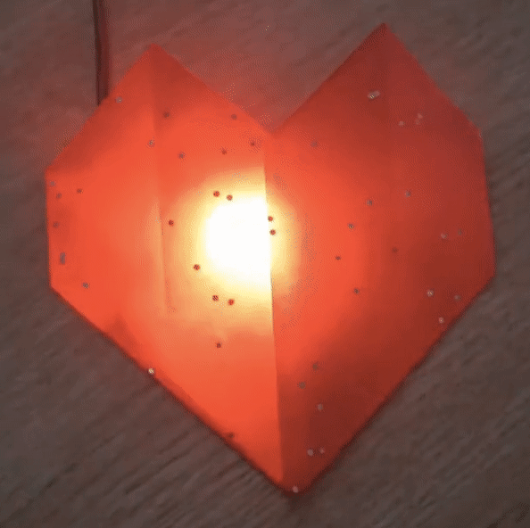
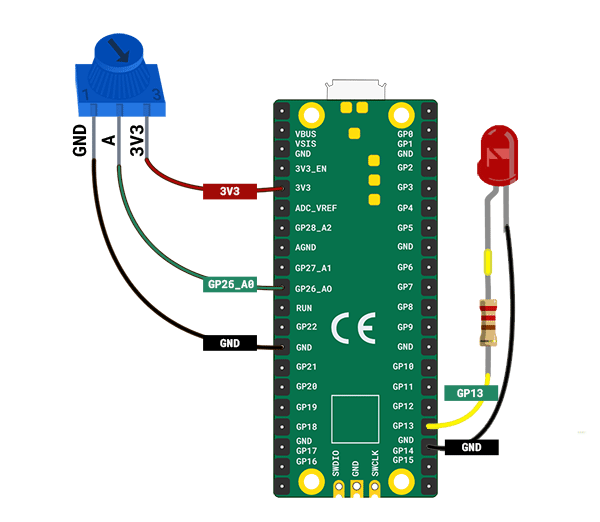

## LED हार्ट की धड़कन

अपने दिल को एक एम्बेडेड LED दिल की धड़कन के साथ जीवन में लाएं।

{:width="300px"}

[[[flashing-light-warning]]]

--- task ---

एक **red** का उपयोग करें जो एक रेज़िस्टर और जम्पर तारों से जुड़ा है।

यदि आपको आवश्यकता है तो आप अपना स्वयं का बना सकते हैं।

[[[led-resistor-electrical-tape]]]

[[[led-resistor-solder-heat-shrink]]]

--- /task ---

--- task ---

लाल LED को **pin 13** और **GND** से कनेक्ट करें, ठीक वैसे ही जैसे आपने LED फायरफ्लाई बनाते समय किया था।

--- /task ---

maggi Aderin-Pocock एक अंतरिक्ष वैज्ञानिक है, जिसने दूरबीन के सहायक उपकरणों, एक हाथ में रखे हुए बारूदी सुरंग के संसूचक, और उपकरणों सहित बहुत सारे इलेक्ट्रॉनिक गेजेट पर काम किया है जिन्हें जलवायु परिवर्तन को समझने में मदद के लिए अंतरिक्ष में भेजा गया है। एक किशोरी के रूप में, मैगी एक अच्छी दूरबीन का खर्च नहीं उठा सकी इसलिए वह एक क्लास में गई जहां वह अपने स्वयं के दूरबीन इलेक्ट्रॉनिक्स, कोड और कांच की पिसाई का उपयोग करके लेंस बना सकती है। क्या आप एक ऐसा गैजेट बनाना चाहते हैं?

--- task ---

कोड जोड़ें ताकि आप अपने LED को प्रोग्राम कर सकें:

--- code ---
---
language: python filename: line_numbers: true line_number_start: 1
line_highlights: 1, 5
---
from picozero import Pot, LED # Add LED from time import sleep

dial = Pot(0) led = LED(13) # Make sure this is the correct pin

--- /code ---

--- /task ---

--- task ---

अपने LED के `brightचमक` को नियंत्रित करने के लिए कोड जोड़ें। `pult()` पद्धति, LED को चमकदार और डिमर प्राप्त करके पल्स करने की अनुमति देती है।

--- code ---
---
language: python filename: line_numbers: true line_number_start: 7
line_highlights: 10-14
---
while True: bpm = heart_min + dial.value * heart_range print(bpm) beat = 60/bpm brighter_time = beat / 2 # Spend half a beat getting brighter dimmer_time = beat / 2 # Spend half a beat getting dimmer

    led.pulse(brighter_time, dimmer_time, n=1, wait=True)  # Pulse 1 time, waiting until finished
--- /code ---

यदि आपने `wait=True` को `pult` में नहीं जोड़ा है तो `while` लूप तुरंत दोहराया जाएगा और पल्स को फिर से शुरू करेगा।

--- /task ---

--- task ---

**परीक्षण:** LED चमकदार और dimer देखने के लिए अपना प्रोजेक्ट चलाएँ। हृदय गति के अनुरूप LED पल्स कितनी तेजी से मेल खाते हैं, इसे नियंत्रित करने के लिए potiometer को घुमाएँ।

--- /task ---

--- task ---

**डीबग:**

आपके पास एक सिंटैक्स त्रुटि है:
+ जांचें कि आपका कोड ऊपर दिए गए उदाहरण से मेल खाता है

potentometer ने काम करना बंद कर दिया:
+ जांचें कि आपके जम्पर के तार अभी भी सुरक्षित रूप से जुड़े हुए हैं

LED प्रकाश नहीं कर रही है:
+ जांचें कि यह सही ढंग से कनेक्ट है
+ यह देखने के लिए जांचें कि क्या LED एक स्पेयर के साथ स्वैप करके उड़ गई है

--- /task ---

--- task ---

अब, अपने पेपरक्राफ्ट हार्ट को लें और इसे अपने लाल LED के ऊपर रखें ताकि दिल की धड़कन का प्रभाव हो।

--- /task ---

