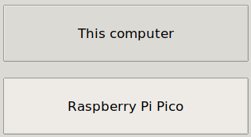

## इसे पोर्टेबल बनाएँ

अपने दिल को एक एम्बेडेड LED दिल की धड़कन के साथ जीवन में लाएं। आप अपने Raspberry Pi Pico को USB पावर सप्लाई या बैटरी पैक के साथ कंप्यूटर से दूर विद्युत कर सकते हैं। जब आप Pico चालू करते हैं तो यह 'munn.py' नामक एक फ़ाइल चलाएगा। 

{:width="300px"}

### main.py का उपयोग करके स्वचालित रूप से अपना धड़कता हुआ दिल प्रोग्राम चलाएँ

--- task ---

**फ़ाइल** मेनू का उपयोग करें अपने कोड को अपने Raspberry Pi Pico उपकरण में सेव करने के लिए, **save As...** विकल्प का उपयोग करें।

--- /task ---

--- task ---

अपने Raspberry Pi Pico में अपना कोड सहेजने के लिए चुनें।

--- /task ---

--- task ---

अपनी फ़ाइल को `main.py` पर कॉल करें ताकि जब आपका पिको एक बाहरी बिजली आपूर्ति से संचालित होता है, आपके कंप्यूटर से जुड़ा नहीं तो यह अपने आप चले।

--- /task ---

--- task ---

यदि इसे Raspberry Pi Pico पर `main.py` के रूप में सहेजा जाता है, तो जब उपकरण एक बाहरी बिजली आपूर्ति जैसे बैटरी से संचालित होगा तब प्रोग्राम लोड होगा।

--- /task ---

### USB सप्लाई का उपयोग करके अपने बीटिंग हार्ट को पावर करें

Raspberry Pi Pico के लिए एक बिजली आपूर्ति की आवश्यकता है जो कम से कम 1.8V और अधिकतम 5.5V तक पहुंचाने में सक्षम हो।

अधिकांश माइक्रो USB ट्रांसफॉर्मर इस रेंज में आपके Raspberry Pi Pico को बिजली प्रदान कर सकते हैं। उदाहरण के लिए, आधिकारिक Raspberry Pi माइक्रो USB ट्रांसफॉर्मर 5.1V पर धारा के 2.5A तक प्रदान करता है।

एक USB से माइक्रो USB केबल के साथ एक बैटरी पैक एक Raspberry Pi Pico भी बिजली सकता है। यह बैटरी पैक 5V पर करंट के 2.1A तक प्रदान करता है।

--- task ---

अपने Raspberry Pi Pico को अपने कंप्यूटर से अलग करें।

--- /task ---

--- task ---

Raspberry Pi Pico को अपने ट्रांसफॉर्मर या बैटरी पैक से कनेक्ट करें।

--- /task ---

--- task ---

**परीक्षण:** अपने USB पावर सप्लाई या बैटरी को चालू करें।

You should be able to turn the potentiometer to adjust the speed of the heartbeat.

<video width="640" height="360" controls>
<source src="images/beating-heart.mp4" type="video/mp4">
आपका ब्राउज़र WebM वीडियो का समर्थन नहीं करता है, FireFox या Chrome आज़माएँ
</video>

--- /task ---

--- task ---

**डीबग:**

--- collapse ---
---
title: LED प्रकाशित नहीं होती है
---

+ क्या आपकी बैटरी काम कर रही है? क्या बैटरी चालू है? आप यह सुनिश्चित करने के लिए एक और USB-संचालित उपकरण का परीक्षण कर सकते हैं।

+ क्या आपने फ़ाइल को `main.py` के रूप में सहेजा है? अपने पिको को अपने कंप्यूटर में वापस प्लग करें और फ़ाइल को फिर से सहेजें। फ़ाइल का नाम और `.py` एक्सटेंशन सावधानीपूर्वक जांचें।

--- /collapse ---

--- /task ---

