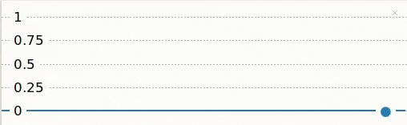
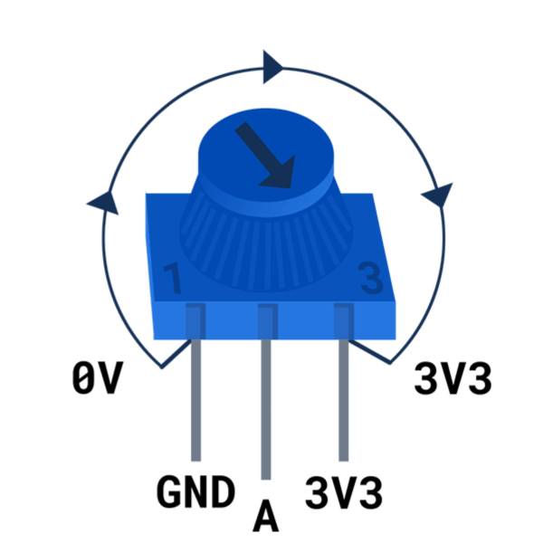
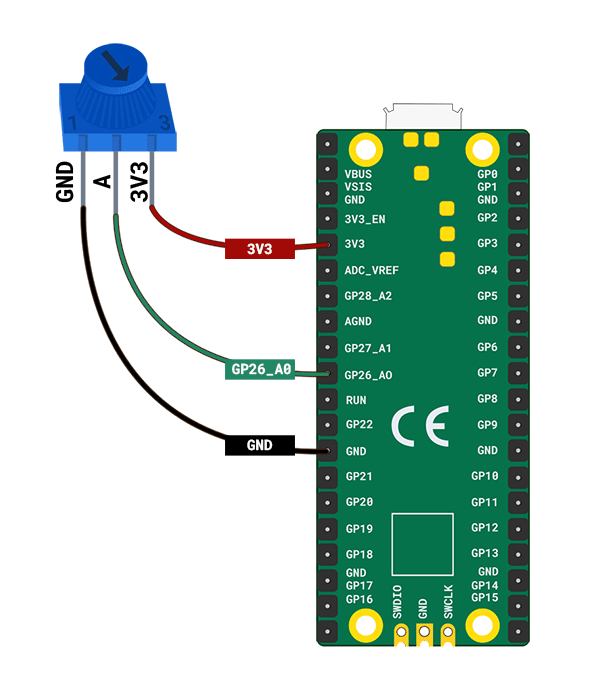
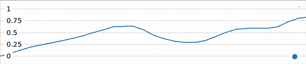

## Lees waarden van een instelwiel

Met een potentiometer (instelwiel) kun je een reeks waarden opgeven. Met de Thonny-plotter kun je deze waarden weergeven, zodat je het effect kunt zien van het draaien van het instelwiel.

{:width="300px"}

De Raspberry Pi Pico heeft drie analoge invoerpinnen die kunnen worden gebruikt om waarden uit analoge ingangscomponenten zoals een potentiometer te lezen. Deze pinnen zijn gelabeld als A0, A1 en A2. De Raspberry Pi Pico kan spanningen van 0 tot 3,3 V lezen met behulp van deze pinnen.

--- task ---

Kijk naar je potentiometer. Let op de knop aan de bovenkant waarmee je hem rechtsom en linksom kunt draaien.

Je zult ook zien dat je potentiometer **drie** pinnen heeft.

Houd de potentiometer op dezelfde manier vast als in dit diagram:

{:width="300px"}

Wanneer de potentiometer helemaal naar links wordt gedraaid, wijst de pijl naar de GND-pin; wanneer deze helemaal naar rechts wordt gedraaid, wijst de pijl naar de 3V3-pin. De middelste pin is de pin waaruit de Raspberry Pi Pico een waarde leest.

--- /task ---

Zorg ervoor dat de Raspberry Pi Pico **losgekoppeld** van de computer is.

--- task ---

Gebruik drie jumperdraden met stekkerbus en sluit er een aan op elke poot van de potentiometer. Je kunt de benen met wat isolatietape vastzetten als ze los voelen.

**Sluit** het andere uiteinde van elke jumperdraad aan op de Raspberry Pi Pico:
+ Verbind de pin met een kleine '1' met de **GND** pin tussen **GP21** en **GP22**
+ Verbind de middelste pin met de **GP26_A0** pin
+ Verbind de pin met een kleine '3' met de **3V3** pin

--- /task ---

--- collapse ---

---
title: Hoe werkt een potentiometer?
---

Een **potentiometer** is een analoog ingangsonderdeel dat zijn weerstand verandert afhankelijk van de positie van het instelwiel. Een potentiometer heeft drie pinnen die moeten worden aangesloten op 3V3, een analoge pin en GND. De pin 3V3 levert voeding aan de potentiometer en de spanningswaarde van de analoge pin zal veranderen afhankelijk van de weerstand van de potentiometer.

--- /collapse ---

--- task ---

Sluit je Raspberry Pi Pico aan op je computer.

Maak in Thonny een nieuw bestand en voeg de volgende code toe aan `print` de waarde van de potentiometer.

--- code ---
---
language: python
filename: 
line_numbers: true
line_number_start: 1
line_highlights: 
---
from picozero import Pot # Pot is een afkorting voor Potentiometer
from time import sleep

instelwiel = Pot(0) # Aangesloten op pin A0 (GP26)

while True:
    print(instelwiel.value)
    sleep(0.1) # Vertraag de uitvoer

--- /code ---

De regel `sleep(0.1)` vertraagt de aflezing en het afdrukken van waarden van de potentiometer zodat Thonny de uitvoer kan bijhouden.

--- /task ---

--- task ---

**Test:** Voer je script uit en Thonny moet beginnen met het afdrukken van waarden naar de shell. Draai aan de potentiometer om de waardeverandering te zien.

--- /task ---

Het is vrij moeilijk om te zien wat er gebeurt als de waarden zo snel worden afgedrukt. Thonny heeft een plotter die je kunt gebruiken om de waarden van de potentiometer te visualiseren.

--- task ---

Kies in Thonny **view**->**plotter** en de plotter verschijnt naast de shell.

--- /task ---

--- task ---

**Test:** Voer je script uit en draai de potentiometer. Let op de waardeverandering in de plotter.

--- print-only ---

--- /print-only ---

--- no-print ---

{:width="300px"}

--- /no-print ---

De waarde moet 0 (of dicht bij 0) zijn wanneer de potentiometer helemaal naar links wordt gedraaid en 1 (of dicht bij 1) wanneer deze helemaal naar rechts wordt gedraaid.

--- /task ---

--- task ---

**Fouten oplossen:**

De waarden zijn omgedraaid.
+ Verwissel de startdraden die zijn aangesloten op **GND** en **3V3**.

--- /task ---

