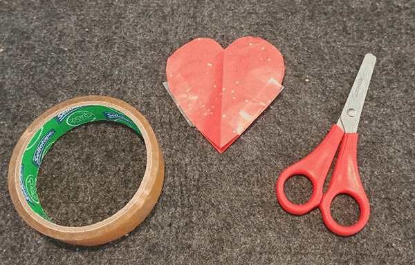
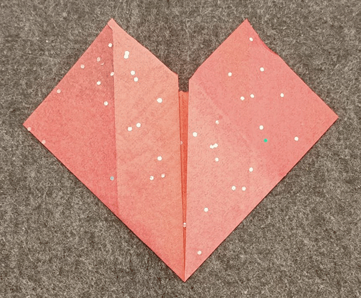
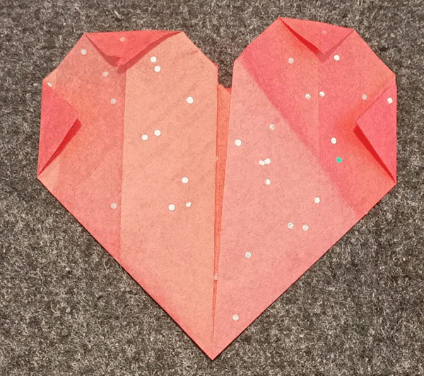

## Maak een papieren hart

Maak het papieren hart om je pulserende LED te bevatten en het licht te verspreiden. 

{:width="300px"}

Papierkunst is de kunst om 2D- of 3D-creaties van papier of karton te maken. Het kunstwerk kan de vorm aannemen van een sculptuur, origami, wearable, of papier-mâché model en kan een of meer in stukjes gesneden of gevouwen papier gebruiken.

--- task ---

**Kies:** Maak een uitgeknipt of een gevouwen origami hart om je pulserende LED erin te plaatsen.

--- collapse ---
---
title: Uit papier geknipt hart
---

Je kunt een eenvoudig hart maken, uit papier geknipt:

Of knip er twee en plak ze samen: 

--- /collapse ---

--- collapse ---
---
title: Gevouwen origami hart
---

Stap 1: Begin met een vierkant stuk papier. (Elk papier doet het, maar dunner papier maakt je LED helderder.) 

Stap 2: Vouw het papier dubbel door de bovenste hoek naar de onderste hoek te vouwen en vouw het vervolgens uit. 

Stap 3: Vouw de linkerhoek naar de rechterhoek en vouw deze vervolgens uit. 

Stap 4: Vouw de bovenste hoek naar het midden van het vierkant om een 'verborgen' vorm te maken. 

Stap 5: Vouw de onderhoek naar boven om de bovenrand te bereiken, waarbij de vorige vouw wordt overlapt. 

Stap 6: Vouw de linker- en rechterbenedenhoek in een hoek van 90 graden, zodat de onderste randen langs de middelste vouw lopen. 

Stap 7: Vouw de boven- en zijhoeken terug. 

Stap 8: Plak de achterkant van het hart vast over het breedste deel, van rand tot rand. 

Draai hem om om om naar de voorkant te kijken en je bent klaar om je LED in te bouwen! 

--- /collapse ---

--- /task ---

