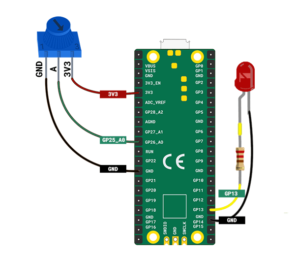
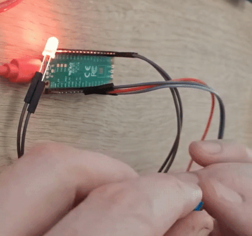

## LED-hartslag

Breng je hart tot leven met een ingebouwde LED-hartslag.

{:width="300px"}

[[[flashing-light-warning]]]

--- task ---

Gebruik een **rode** LED die is aangesloten op een weerstand en jumperdraden.

Je kunt het zelf maken als dat nodig is.

[[[led-resistor-electrical-tape]]]

[[[led-resistor-solder-heat-shrink]]]

--- /task ---

--- task ---

Sluit de rode LED aan op **pin 13** en **GND**, net zoals je deed toen je een LED vuurvlieg maakte.

--- /task ---

Maggie Aderin-Pocock is een ruimtewetenschapper die heeft gewerkt aan veel elektronische gadgets, waaronder telescoopaccessoires, een draagbare landmijndetector en instrumenten die naar de ruimte zijn gestuurd om gegevens te verzamelen om de klimaatverandering te helpen begrijpen. Als tiener kon Maggie zich geen goede telescoop veroorloven, dus ging ze naar een workshop waar ze haar eigen telescoop kon maken met behulp van elektronica, code en glas slijpen om lenzen te maken. Is er een gadget die je wilt maken?

--- task ---

Voeg code toe zodat je je LED kunt programmeren:

--- code ---
---
language: python
filename: 
line_numbers: true
line_number_start: 1
line_highlights: 1, 5
---
from picozero import Pot, LED # Voeg LED toe
from time import sleep

instelwiel = Pot(0)
led = LED(13) # Zorg ervoor dat dit de juiste pin is

--- /code ---

--- /task ---

--- task ---

Voeg code toe om de `helderheid` van je LED te regelen. De `pulse()` methode laat de LED een pulse geven door helderder en donkerder te worden.

--- code ---
---
language: python
filename: 
line_numbers: true
line_number_start: 7
line_highlights: 10-14
---
while True: 
    bpm = hart_min + instelwiel.value * hart_bereik
    print(bpm)
    slagen = 60/bpm
    helder_tijd = slagen / 2 # Geef een halve beat door die helderder wordt
    dimmer_tijd = slagen / 2 # Geef een halve beat door om donkerder te worden

    led.pulse(helder_tijd, dimmer_tijd, n=1, wait=True)  # Pulseer 1 keer, wacht tot je klaar bent

--- /code ---

Als je `wait=True` niet hebt toegevoegd aan `Pulse`, dan zou de `while` lus onmiddellijk herhalen en de pulse opnieuw starten.

--- /task ---

--- task ---

**Test:** Voer je project uit om de LED-pulse helderder en donkerder te zien. Draai aan de potentiometer om te bepalen hoe snel de LED-pulsen overeenkomen met de hartslag.

--- /task ---

--- task ---

**Fouten oplossen:**

Je hebt een syntaxisfout:
+ Controleer of de code overeenkomt met het bovenstaande voorbeeld

De potentiometer is gestopt met werken:
+ Controleer of de jumperdraden nog steeds goed vastzitten

De LED brandt niet:
+ Controleer of deze correct is aangesloten
+ Controleer of de LED is doorgebrand door deze te verwisselen met een reserve

--- /task ---

--- task ---

Neem nu je papercraft hart en plaats het over je rode LED om een hartslageffect te maken.

--- /task ---

