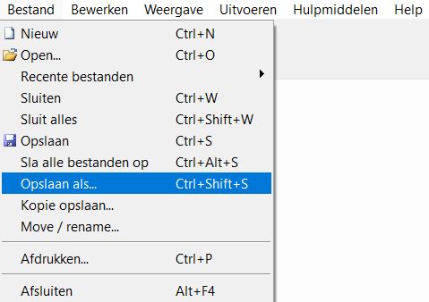
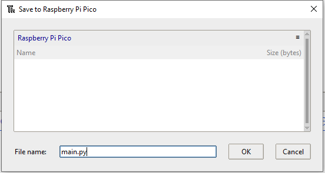
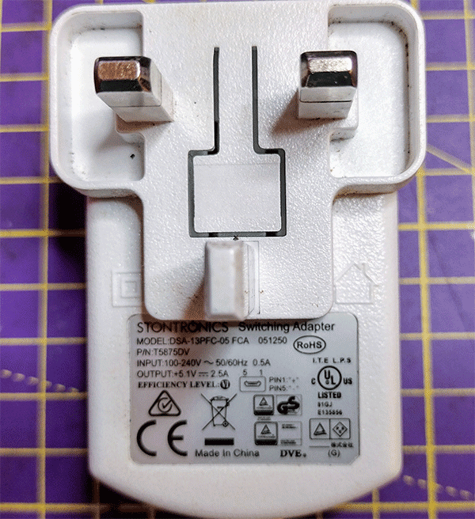

## Maak het draagbaar

Breng je hart tot leven met een ingebouwde LED-hartslag. Je kunt de Raspberry Pi Pico los van de computer voeden met een USB-voeding of batterij. Wanneer je de Pico inschakelt, wordt er een bestand met de naam 'main.py' uitgevoerd. 

{:width="300px"}

### Voer automatisch je hartslag programma uit met main.py

--- task ---

Gebruik het menu **Bestand** om de code op te slaan op je Raspberry Pi Pico-apparaat met behulp van de optie **Opslaan als...**.

--- /task ---

--- task ---

Kies om je code op te slaan in je Raspberry Pi Pico.

--- /task ---

--- task ---

Roep het bestand `main.py` op om het automatisch te laten uitvoeren wanneer de Pico wordt gevoed door een externe voedingsbron, en niet aangesloten is op de computer.

--- /task ---

--- task ---

Als het wordt opgeslagen als `main.py` op de Raspberry Pi Pico, wordt het programma geladen wanneer het apparaat wordt gevoed door een externe voedingsbron, zoals een batterij.

--- /task ---

### Geef je kloppende hart energie met een USB-voeding

De Raspberry Pi Pico heeft een voeding nodig die een minimum van 1,8V en een maximum van 5,5 V kan leveren.

De meeste micro-USB-adapters kunnen voeding leveren aan je Raspberry Pi Pico in deze serie. De officiële Raspberry Pi micro USB-adapter levert bijvoorbeeld tot 2,5 A stroom bij 5,1 V.

Een batterij met een USB-naar-micro-USB-kabel kan ook een Raspberry Pi Pico van stroom voorzien. Deze batterij levert tot 2,1 A stroom bij 5 V.

--- task ---

Koppel de Raspberry Pi Pico los van de computer.

--- /task ---

--- task ---

Sluit de Raspberry Pi Pico aan op je transformator of batterij.

--- /task ---

--- task ---

**Test:** Schakel de USB-voeding of batterij in.

Je zou de potentiometer moeten kunnen draaien om de snelheid van de hartslag aan te passen.

<video width="640" height="360" controls>
<source src="images/beating-heart.mp4" type="video/mp4">
Je browser ondersteunt geen WebM-video, probeer Firefox of Chrome
</video>

--- /task ---

--- task ---

**Fouten oplossen:**

--- collapse ---
---
title: De LED licht niet op.
---

+ Werkt de batterij? Is de batterij ingeschakeld? Je kunt een ander USB-apparaat testen om dit te controleren.

+ Heb je het bestand opgeslagen als `main.py`? Sluit je Pico weer aan op je computer en sla het bestand opnieuw op. Controleer de bestandsnaam en de `.py` extensie zorgvuldig.

--- /collapse ---

--- /task ---

