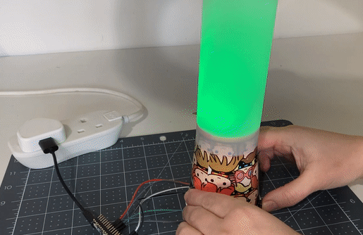

## Wat nu?

Als je het [Inleiding tot Raspberry Pi Pico](https://projects.raspberrypi.org/en/raspberrypi/pico-intro) pad volgt, kun je naar het [Mood indicator](https://projects.raspberrypi.org/en/projects/mood-indicator) project gaan. In dit project maak je een apparaat voor het checken van je stemming met gekleurde lampjes om je huidige stemming te weerspiegelen.

--- print-only ---

--- /print-only ---

--- no-print ---

--- /no-print ---
