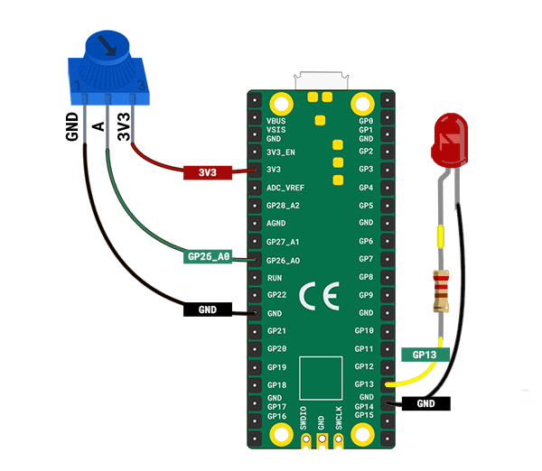

## LED heart beat

Bring your heart to life with an embedded LED heartbeat.

{:width="300px"}

[[[flashing-light-warning]]]

--- task ---

Use a **red** LED connected to a resistor and jumper wires.

You can make your own if you need to.

[[[led-resistor-electrical-tape]]]

[[[led-resistor-solder-heat-shrink]]]

--- /task ---

--- task ---

Connect the red LED to **pin 13** and **GND**, just like you did when you made an LED firefly.

--- /task ---

Maggie Aderin-Pocock is a space scientist who has worked on lots of electronic gadgets including telescope accessories, a handheld landmine detector, and instruments that have been sent to space to gather data to help understand climate change. As a teenager, Maggie couldn't afford a good telescope so she went to a class where she could make her own telescope using electronics, code, and glass grinding to make lenses. Is there a gadget you would like to make?

--- task ---

Add code so that you can program your LED:

--- code ---
---
language: python filename: line_numbers: true line_number_start: 1
line_highlights: 1, 5
---
from picozero import Pot, LED # Add LED from time import sleep

dial = Pot(0) led = LED(13) # Make sure this is the correct pin

--- /code ---

--- /task ---

--- task ---

Add code to control the `brightness` of your LED. The `pulse()` method allows the LED to pulse by getting brighter and dimmer.

--- code ---
---
language: python filename: line_numbers: true line_number_start: 7
line_highlights: 10-14
---
while True: bpm = heart_min + dial.value * heart_range print(bpm) beat = 60/bpm brighter_time = beat / 2 # Spend half a beat getting brighter dimmer_time = beat / 2 # Spend half a beat getting dimmer

    led.pulse(brighter_time, dimmer_time, n=1, wait=True)  # Pulse 1 time, waiting until finished
--- /code ---

If you didn't add `wait=True` to `pulse` then the `while` loop would repeat immediately and restart the pulse.

--- /task ---

--- task ---

**Test:** Run your project to see the LED pulse brighter and dimmer. Turn the potentiometer to control how fast the LED pulses to correspond to the heart rate.

--- /task ---

--- task ---

**Debug:**

You have a syntax error:
+ Check that your code matches the example above

The potentiometer stopped working:
+ Check that your jumper wires are still securely attached

The LED is not lighting:
+ Check that it is connected correctly
+ Check to see if the LED has blown by swapping it with a spare

--- /task ---

--- task ---

Now, take your papercraft heart and place it over your red LED to make a heartbeat effect.

--- /task ---

