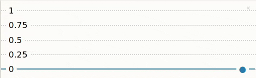

## Läs värden från en ratt

En potentiometer (ratt) låter dig variera värden. Thonny-plottern låter dig visa dessa värden så att du kan se effekten av att vrida på ratten.

{:width="300px"}

Raspberry Pi Pico har tre analoga ingångsstift som kan användas för att läsa värden från analoga ingångskomponenter såsom en potentiometer. Dessa stift är märkta A0, A1 och A2. Raspberry Pi Pico kan läsa spänningar från 0 till 3,3V med dessa stift.

--- task ---

Titta på din potentiometer. Lägg märke till ratten på toppen som gör att du kan vrida den medurs och moturs.

Du kommer också att märka att din potentiometer har **tre** stift.

Håll din potentiometer på samma sätt som i detta diagram:

{:width="300px"}

När potentiometern vrids hela vägen åt vänster pekar pilen på GND-stiftet; när den vrids hela vägen åt höger pekar pilen på 3V3-stiftet. Mittstiftet är stiftet som Raspberry Pi Pico läser ett värde från.

--- /task ---

Se till att din Raspberry Pi Pico är **urkopplad** från din dator.

--- task ---

Använd tre socket-socket-byglingskablar och anslut en till varje ben på potentiometern. Du kan behöva fästa benen med lite elektrisk tejp om de känns lösa.

**Anslut** den andra änden av varje bygelkabel till Raspberry Pi Pico:
+ Anslut stiftet märkt med '1' till **GND** stiftet mellan **GP21** och **GP22**
+ Anslut mittstiftet till **GP26_A0** stiftet
+ Anslut stiftet märkt med "3" till stiftet **3V3**

--- /task ---

--- collapse ---

---
title: Hur fungerar en potentiometer?
---

En **potentiometer** är en analog ingångskomponent som ändrar sitt motstånd beroende på rattens position. En potentiometer har tre stift som måste kopplas till 3V3, ett analogt stift och GND. 3V3-stiftet ger ström till potentiometern och spänningsavläsningen från det analoga stiftet kommer att ändras beroende på potentiometerns motstånd.

--- /collapse ---

--- task ---

Anslut din Raspberry Pi Pico till din dator.

I Thonny, skapa en ny fil och lägg till följande kod för att `skriva ut` värdet från potentiometern.

--- code ---
---
language: python filename: line_numbers: true line_number_start: 1
line_highlights:
---
from picozero import Pot # Pot is short for Potentiometer from time import sleep

dial = Pot(0) # Connected to pin A0 (GP26)

while True: print(dial.value) sleep(0.1) # Slow down the output

--- /code ---

Raden `sleep(0.1)` saktar ner läsningen och utskriften av värden från potentiometern så att Thonny kan hänga med i resultatet.

--- /task ---

--- task ---

**Test:** Kör ditt skript och Thonny bör börja skriva ut värden till skalet. Vrid potentiometern för att se värdet ändras.

--- /task ---

Det är ganska svårt att se vad som händer när värdena skrivs ut så snabbt. Thonny har en plotter som du kan använda för att visualisera värdena från potentiometern istället.

--- task ---

I Thonny väljer du **Visa**->**Plotter** och plottern kommer att dyka upp bredvid skalet.

--- /task ---

--- task ---

**Test:** Kör ditt skript och vrid potentiometern. Se värdet ändras i plottern.

--- print-only ---

--- /print-only ---

--- no-print ---

{:width="300px"}

--- /no-print ---

Värdet ska vara 0 (eller nära 0) när potentiometern vrids hela vägen åt vänster och 1 (eller nära 1) när den vrids hela vägen åt höger.

--- /task ---

--- task ---

**Debug (Felsökning):**

Värdena är på fel håll.
+ Skifta bygelkablarna som är anslutna till **GND** och **3V3**.

--- /task ---

