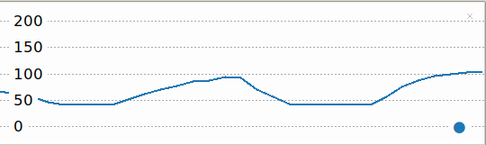

## Beräkna slag per minut (BPM)

Potentiometervärdena går från 0 till 1. För att använda potentiometern för att kontrollera hjärtfrekvensen måste du omvandla dessa värden till ett motsvarande antal från 40 (mycket vältränad idrottare) till 180 slag per minut. 

{:width="300px"}

BPM står för **slag per minut**. Du kan använda BPM för att mäta din puls (liksom musikens tempo). Ju högre siffra, desto snabbare puls. BPM används inom hälsa och fitness för att mäta hur intensiv en träning är. Du kan räkna ut din maxpuls genom att ta bort din ålder från 220. Till exempel är en 12-årings maxpuls 208. När du tränar rekommenderas det att din puls inte överstiger 85 % av din maxpuls. I fallet med en 12-åring skulle detta vara 176 BPM. Det är ungefär samma tempo som ett Drum 'n' Bass-spår.

Du ska nu använda potentiometern för att justera ditt projekts hjärtslag. Du vrider på ratten för att öka eller minska hjärtslag.

--- task ---

Uppdatera din kod så att värdet som skrivs ut och plottas motsvarar en puls mellan 40 och 180 slag per minut.

--- code ---
---
language: python filename: line_numbers: true line_number_start: 1
line_highlights: 6-13
---
from picozero import Pot from time import sleep

dial = Pot(0)

heart_min = 40 heart_max = 180 heart_range = heart_max - heart_min # Calculate the difference

while True: bpm = heart_min + dial.value * heart_range # Convert dial value to BPM print(bpm) sleep(0.1)

--- /code ---

Lägg märke till att `heart_range` variabeln beräknas **en gång** i början av ditt skript, men `bpm` variabeln beror på potentiometerns värde så att det beräknas inuti `while`-loopen.

--- /task ---

--- task ---

**Test:** Kör din kod och vrid potentiometern för att se hur siffran i skalet och etiketterna i Thonny-plottern ändras. Du bör nu se siffror mellan 40 och 180.

--- /task ---

--- task ---

**Debug (Felsökning):**

Du har ett syntaxfel:
+ Kontrollera att din kod matchar exemplet ovan

Potentiometern slutade fungera:
+ Kontrollera att dina bygelkablar fortfarande är ordentligt fastsatta

--- /task ---

