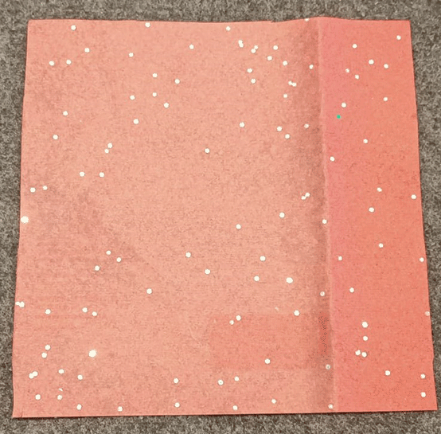
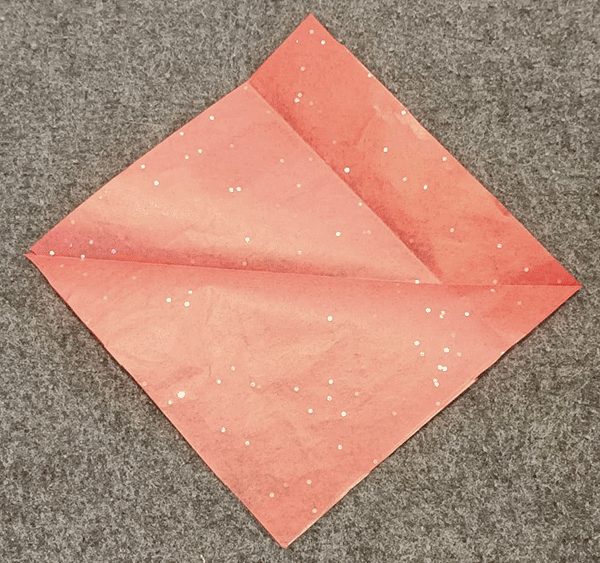

## Gör ett pappershjärta

Skapa ett pappershjärta som innehåller din pulserande lysdiod och sprider ljuset. 

{:width="300px"}

Papperskonst är konsten att göra 2D- eller 3D-skapelser av papper eller kort. Konstverket kan ha formen av en skulptur, origami, bärbar eller papier-maché-modell och använda en eller flera bitar av klippt eller vikt papper.

--- task ---

**Välj:** Gör ett urklipp eller ett vikt origamihjärta för att sätta in din pulserande lysdiod.

--- collapse ---
---
title: Pappersutskuret hjärta
---

Du kan göra ett enkelt hjärta, genom att klippa till papper:

Eller klipp två och tejpa ihop dem: 

--- /collapse ---

--- collapse ---
---
title: Vikt origami-hjärta
---

Steg 1: Börja med ett fyrkantigt papper. (Allt papper duger, men tunnare papper gör att din lysdiod lyser starkare.)

Steg 2: Vik papperet på mitten genom att vika det övre hörnet till det nedre hörnet och vik sedan ut det.

Steg 3: Vik det vänstra hörnet till det högra hörnet och vik sedan ut det.

Steg 4: Vik det övre hörnet till mitten av fyrkanten för att skapa en "sköld"-form.

Steg 5: Vik upp det nedre hörnet för att möta den övre kanten och överlappa föregående veck.

Steg 6: Vik de nedre vänstra och högra ändarna i 90 graders vinkel, så att deras nedre kanter löper längs mittvecket.

Steg 7: Vik de övre och sidohörnen bakåt.

Steg 8: Tejpa baksidan av hjärtat över den bredaste delen, från kant till kant.

Vänd på den för att titta på framsidan och du är redo att montera in din lysdiod!

--- /collapse ---

--- /task ---

