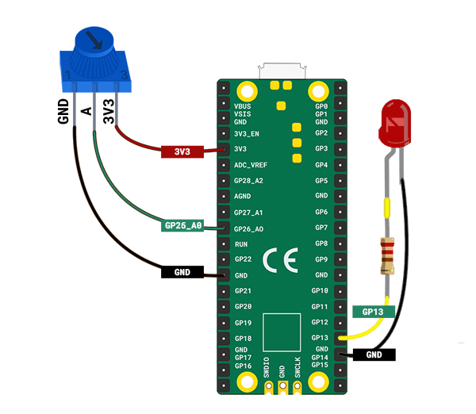

## Lysdiod-hjärtslag

Väck ditt hjärta till liv med ett inbyggt lysdiod-hjärtslag.

{:width="300px"}

[[[flashing-light-warning]]]

--- task ---

Använd en **röd** lysdiod ansluten till ett motstånd och kopplingskablar.

Du kan göra din egen om du behöver.

[[[led-resistor-electrical-tape]]]

[[[led-resistor-solder-heat-shrink]]]

--- /task ---

--- task ---

Anslut den röda lysdioden till **stift 13** och **GND**, precis som du gjorde när du gjorde en lysdiod-eldfluga.

--- /task ---

Maggie Aderin-Pocock är en rymdforskare som har arbetat med massor av elektroniska prylar inklusive teleskoptillbehör, en handhållen landmindetektor och instrument som har skickats till rymden för att samla in data för att förstå klimatetförändringar. Som tonåring hade Maggie inte råd med ett bra teleskop så hon gick till en klass där hon kunde göra sitt eget teleskop med hjälp av elektronik, kod och glasslipning för att göra linser. Finns det en pryl du skulle vilja göra?

--- task ---

Lägg till kod så att du kan programmera din lysdiod:

--- code ---
---
language: python filename: line_numbers: true line_number_start: 1
line_highlights: 1, 5
---
from picozero import Pot, LED # Add LED from time import sleep

dial = Pot(0) led = LED(13) # Make sure this is the correct pin

--- /code ---

--- /task ---

--- task ---

Lägg till kod för att styra `ljusstyrkan` på din lysdiod. Metoden `pulse()` låter lysdioden pulsera genom att bli ljusare och svagare.

--- code ---
---
language: python filename: line_numbers: true line_number_start: 7
line_highlights: 10-14
---
while True: bpm = heart_min + dial.value * heart_range print(bpm) beat = 60/bpm brighter_time = beat / 2 # Spend half a beat getting brighter dimmer_time = beat / 2 # Spend half a beat getting dimmer

    led.pulse(brighter_time, dimmer_time, n=1, wait=True)  # Pulse 1 time, waiting until finished
--- /code ---

Om du inte lade till `wait=True` till `puls` så skulle `while`-slingan upprepas omedelbart och starta om pulsen.

--- /task ---

--- task ---

**Test:** Kör ditt projekt för att se lysdiod-pulsen ljusare och svagare. Vrid potentiometern för att kontrollera hur snabbt lysdioden pulserar för att motsvara hjärtfrekvensen.

--- /task ---

--- task ---

**Debug (Felsökning):**

Du har ett syntaxfel:
+ Kontrollera att din kod matchar exemplet ovan

Potentiometern slutade fungera:
+ Kontrollera att dina bygelkablar fortfarande är ordentligt fastsatta

Lysdioden lyser inte:
+ Kontrollera att den är korrekt ansluten
+ Kontrollera om lysdioden har gått sönder genom att byta ut den mot en annan

--- /task ---

--- task ---

Ta nu ditt pappers-hjärta och placera det över din röda lysdiod för att skapa en hjärtslagseffekt.

--- /task ---

