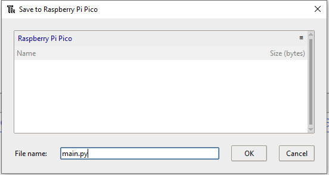

## Gör den portabel

Väck ditt hjärta till liv med ett inbyggt lysdiod-hjärtslag. Du kan driva din Raspberry Pi Pico bort från datorn med ett USB-nätaggregat eller batteri. När du slår på Pico kör den en fil som heter `main.py`. 

{:width="300px"}

### Kör ditt hjärtslagande program automatiskt med main.py

--- task ---

Använd menyn **File** för att spara din kod på din Raspberry Pi Pico-enhet, med alternativet **Save as...** .

--- /task ---

--- task ---

Välj att spara din kod till din Raspberry Pi Pico.

--- /task ---

--- task ---

Döp din fil till `main.py` för att få den att köras automatiskt när din Pico får ström från en extern strömkälla, alltså inte ansluten till din dator.

--- /task ---

--- task ---

Om det är sparat som `main.py` på Raspberry Pi Pico, kommer programmet att laddas när enheten får ström från en extern strömkälla, till exempel ett batteri.

--- /task ---

### Driv ditt bankande hjärta med en USB-källa

Raspberry Pi Pico kräver en strömförsörjning som kan leverera minst 1,8V och maximalt 5,5V.

De flesta mikro-USB-transformatorer kan ge ström till din Raspberry Pi Pico i detta spannet. Till exempel ger den officiella Raspberry Pi micro USB-transformatorn upp till 2,5A ström vid 5,1V.

Ett batteripaket med en USB till mikro-USB-kabel kan också driva en Raspberry Pi Pico. Detta batteripaket ger upp till 2,1A ström vid 5V.

--- task ---

Koppla bort din Raspberry Pi Pico från din dator.

--- /task ---

--- task ---

Anslut Raspberry Pi Pico till din transformator eller batteripaket.

--- /task ---

--- task ---

**Test:** Slå på din USB-strömkälla eller batteri.

Du bör kunna vrida potentiometern för att justera hjärtslagshastigheten.

<video width="640" height="360" controls>
<source src="images/beating-heart.mp4" type="video/mp4">
Din webbläsare stöder inte WebM-video, prova FireFox eller Chrome
</video>

--- /task ---

--- task ---

**Debug (Felsökning):**

--- collapse ---
---
title: Lysdioden lyser inte
---

+ Fungerar ditt batteri? Är batteriet påslaget? Du kan testa en annan USB-driven enhet för att vara säker.

+ Sparade du filen som `main.py`? Anslut din Pico till din dator och spara filen igen. Kontrollera filnamnet och tillägget `.py` noggrant.

--- /collapse ---

--- /task ---

