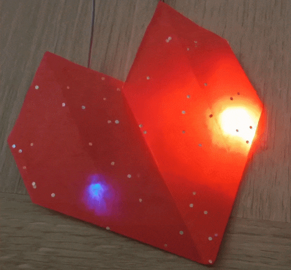

## Uppgradera ditt projekt

Om du har tid kan du uppgradera ditt projekt. 

Du kan använda ditt bärbara bultande hjärta som rumsdekoration. Ställ in den på en låg hastighet för att hjälpa dig slappna av. Eller justera takten så att den matchar musiken du lyssnar på. 

{:width="300px"}

--- task ---

Du kan:
+ Skapa ett bättre pappershjärta.
+ Lägg till en blå lysdiod för att representera syrefattigt blod som kommer in i och lämnar hjärtat.
+ Lägg till ett hjärtslagsljud med en passiv summer.
+ Lägg till fler lysdioder och papercraft-hjärtan och få dem att pulsera samtidigt. Välj vilken färg på lysdiod du vill.

--- /task ---

--- collapse ---

---
title: Avslutat projekt
---

Du kan se det [avslutade projektet här](https://rpf.io/p/sv-SE/beating-heart-get){:target="_blank"}.

--- /collapse ---
