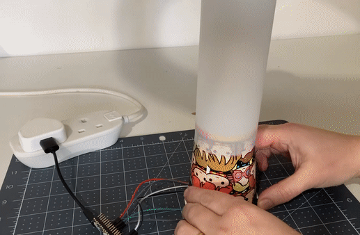

## Vad härnäst?

Om du följer [Introduktion till Raspberry Pi Pico](https://projects.raspberrypi.org/en/raspberrypi/pico-intro) -vägen kan du gå vidare till [Humörindikator](https://projects.raspberrypi.org/en/projects/mood-indicator) -projektet. I det här projektet kommer du att skapa en enhet för incheckning av humör med färgade lampor för att känna igen ditt nuvarande humör.

--- print-only ---

--- /print-only ---

--- no-print ---

--- /no-print ---
